# Observability Platform — High Level Design Document

| Field          | Detail                          |
|----------------|---------------------------------|
| **Document**   | High Level Design (HLD)         |
| **Version**    | 1.0                             |
| **Date**       | March 15, 2026                  |
| **Status**     | Draft                           |
| **Author**     | Architecture Team               |

---

## Table of Contents

1. [Executive Summary](#1-executive-summary)
2. [Goals & Non-Goals](#2-goals--non-goals)
3. [Technology Stack](#3-technology-stack)
4. [System Architecture Overview](#4-system-architecture-overview)
5. [Signal Ingestion Pipeline](#5-signal-ingestion-pipeline)
6. [Module Design](#6-module-design)
   - 6.1 [User Management](#61-user-management)
   - 6.2 [APM Management](#62-apm-management)
   - 6.3 [Metrics](#63-metrics)
   - 6.4 [Logs](#64-logs)
   - 6.5 [Traces](#65-traces)
   - 6.6 [SLA Setup & KPI Alerting](#66-sla-setup--kpi-alerting)
   - 6.7 [Dependency Metrics](#67-dependency-metrics)
   - 6.8 [Workflow Configuration (Marker)](#68-workflow-configuration-marker)
   - 6.9 [Dashboards](#69-dashboards)
   - 6.10 [Reports](#610-reports)
   - 6.11 [Synthetic Monitoring](#611-synthetic-monitoring)
   - 6.12 [AI Capabilities](#612-ai-capabilities)
   - 6.13 [AI/ML Monitoring](#613-aiml-monitoring)
7. [Data Flow Architecture](#7-data-flow-architecture)
8. [Database Schema Design (Logical)](#8-database-schema-design-logical)
9. [API Design Overview](#9-api-design-overview)
10. [Security Architecture](#10-security-architecture)
11. [Deployment Architecture](#11-deployment-architecture)
12. [Scalability & Performance Considerations](#12-scalability--performance-considerations)
13. [Appendix](#13-appendix)

---

## 1. Executive Summary

This document describes the High Level Design of a unified **Observability Platform** that provides end-to-end visibility into application performance, health, and business-workflow traceability. The platform ingests the three pillars of observability — **Metrics, Logs, and Traces** — through a single OpenTelemetry Collector gateway, stores them in purpose-built backends (Prometheus, Elasticsearch, Jaeger), and exposes a rich React-based UI backed by Java Spring Boot microservices and PostgreSQL.

Beyond traditional APM, the platform introduces **Business Workflow Mapping (Marker)**, **SLA/KPI-driven alerting**, **Synthetic Monitoring**, and **AI-powered recommendations** (error root-cause, query optimisation, self-healing triggers), making it a next-generation operations intelligence suite.

---

## 2. Goals & Non-Goals

### Goals

- Provide a unified pane-of-glass for metrics, logs, and traces across all services.
- Enable zero-touch onboarding of new services via OpenTelemetry auto-instrumentation.
- Map technical signals to business workflows for end-to-end traceability.
- Offer AI-driven recommendations for error remediation, performance tuning, and self-healing.
- Support configurable SLA thresholds, KPI alerting (Email, SMS, Teams), and synthetic monitoring.
- Provide RBAC-controlled dashboards, reports, and administration.

### Non-Goals

- Replacing existing CI/CD or deployment pipelines (out of scope).
- Acting as a full SIEM or security-focused logging platform.
- Real-time stream processing of raw telemetry (batch analytics deferred to a future phase).

---

## 3. Technology Stack

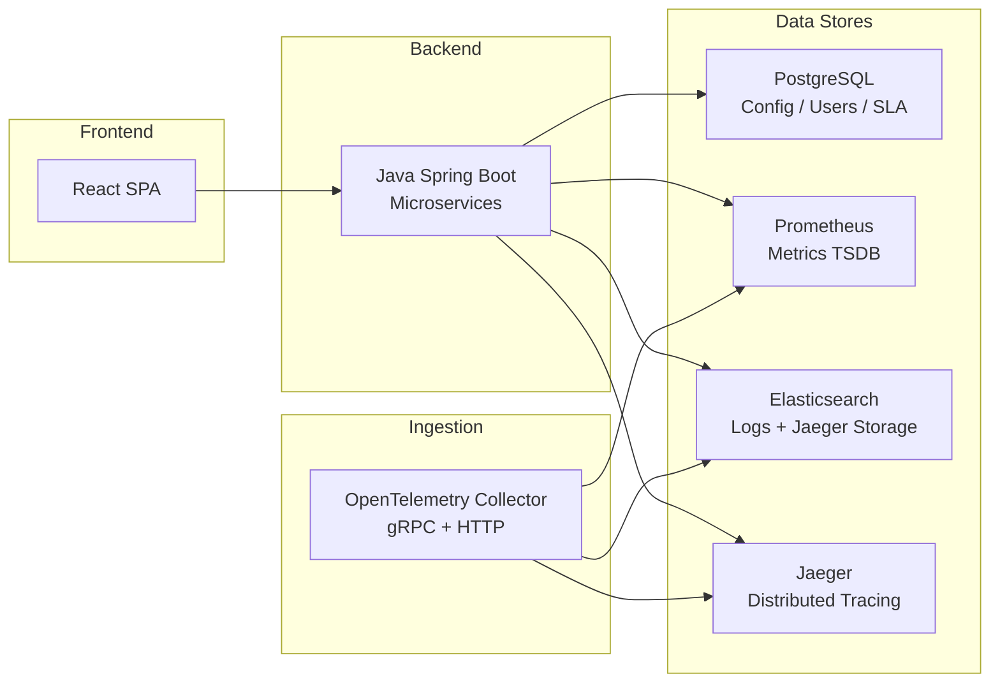
```mermaid
graph LR
    subgraph Frontend
        A[React SPA]
    end

    subgraph Backend
        B[Java Spring Boot<br>Microservices]
    end

    subgraph Data Stores
        C[PostgreSQL<br>Config / Users / SLA]
        D[Prometheus<br>Metrics TSDB]
        E[Elasticsearch<br>Logs + Jaeger Storage]
        F[Jaeger<br>Distributed Tracing]
    end

    subgraph Ingestion
        G[OpenTelemetry Collector<br>gRPC + HTTP]
    end

    A --> B
    B --> C
    B --> D
    B --> E
    B --> F
    G --> D
    G --> E
    G --> F
```

| Layer          | Technology                              | Purpose                                      |
|----------------|-----------------------------------------|----------------------------------------------|
| Frontend       | React                                   | SPA dashboard, configuration UI              |
| Backend        | Java 25 / Spring Boot 3.x              | REST APIs, business logic, orchestration      |
| Database       | PostgreSQL 15+                          | Users, roles, SLA config, workflow mapping    |
| Metrics Store  | Prometheus                              | Time-series metrics storage and querying      |
| Log Store      | Elasticsearch 8.x                       | Log storage, full-text search, Jaeger backend |
| Trace Store    | Jaeger (ES backend)                     | Distributed trace storage and querying        |
| Ingestion      | OpenTelemetry Collector                 | Unified signal ingestion (gRPC + HTTP)        |
| Alerting       | Custom Alert Engine + Alertmanager      | SLA/KPI threshold evaluation and notification |
| AI/ML          | Python sidecar / Spring AI              | Anomaly detection, recommendations            |

---

## 4. System Architecture Overview

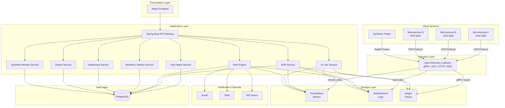
```mermaid
flowchart TB
    subgraph Client Systems
        CS1[Microservice A<br>OTel SDK]
        CS2[Microservice B<br>OTel SDK]
        CS3[Microservice N<br>OTel SDK]
        CS4[Synthetic Prober]
    end

    subgraph Ingestion Layer
        OC[OpenTelemetry Collector<br>gRPC :4317 / HTTP :4318]
    end

    subgraph Storage Layer
        PR[Prometheus<br>Metrics]
        ES[Elasticsearch<br>Logs]
        JG[Jaeger<br>Traces]
    end

    subgraph Application Layer
        API[Spring Boot API Gateway]
        UM[User Mgmt Service]
        APM[APM Service]
        ALR[Alert Engine]
        WF[Workflow / Marker Service]
        DASH[Dashboard Service]
        RPT[Report Service]
        SYN[Synthetic Monitor Service]
        AIS[AI / ML Service]
    end

    subgraph Data Layer
        PG[(PostgreSQL)]
    end

    subgraph Presentation Layer
        UI[React Frontend]
    end

    subgraph Notification Channels
        EM[Email]
        SMS[SMS]
        TM[MS Teams]
    end

    CS1 & CS2 & CS3 -->|OTel Protocol| OC
    CS4 -->|Health Probes| OC

    OC -->|remote_write| PR
    OC -->|bulk index| ES
    OC -->|gRPC export| JG

    UI --> API
    API --> UM & APM & ALR & WF & DASH & RPT & SYN & AIS

    UM & APM & ALR & WF & DASH & RPT & SYN --> PG
    APM --> PR & ES & JG
    ALR --> PR & ES
    AIS --> PR & ES & JG
    ALR --> EM & SMS & TM
```

---

## 5. Signal Ingestion Pipeline

All client systems emit telemetry using the OpenTelemetry SDK. Signals arrive at a centralized **OpenTelemetry Collector** cluster that acts as the single entry-point.

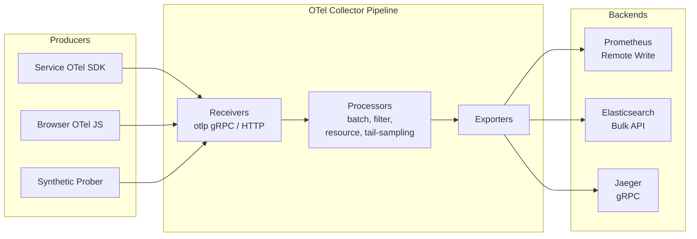
```mermaid
flowchart LR
    subgraph Producers
        P1[Service OTel SDK]
        P2[Browser OTel JS]
        P3[Synthetic Prober]
    end

    subgraph OTel Collector Pipeline
        R1[Receivers<br>otlp gRPC / HTTP]
        PR1[Processors<br>batch, filter,<br>resource, tail-sampling]
        E1[Exporters]
    end

    subgraph Backends
        EX_P[Prometheus<br>Remote Write]
        EX_E[Elasticsearch<br>Bulk API]
        EX_J[Jaeger<br>gRPC]
    end

    P1 & P2 & P3 --> R1
    R1 --> PR1 --> E1
    E1 --> EX_P & EX_E & EX_J
```

### Collector Configuration Highlights

| Concern             | Strategy                                                                 |
|----------------------|-------------------------------------------------------------------------|
| Protocol support     | OTLP gRPC (`:4317`) and OTLP HTTP (`:4318`)                            |
| Batching             | `batch` processor — 5 s timeout, 1024 batch size                       |
| Filtering            | `filter` processor — drop debug spans in production                    |
| Tail Sampling        | `tail_sampling` processor — retain error/slow traces at higher rate    |
| Resource Enrichment  | `resource` processor — inject environment, cluster, region attributes  |
| High Availability    | Horizontally scaled collectors behind an L4 load-balancer              |

---

## 6. Module Design

---

### 6.1 User Management

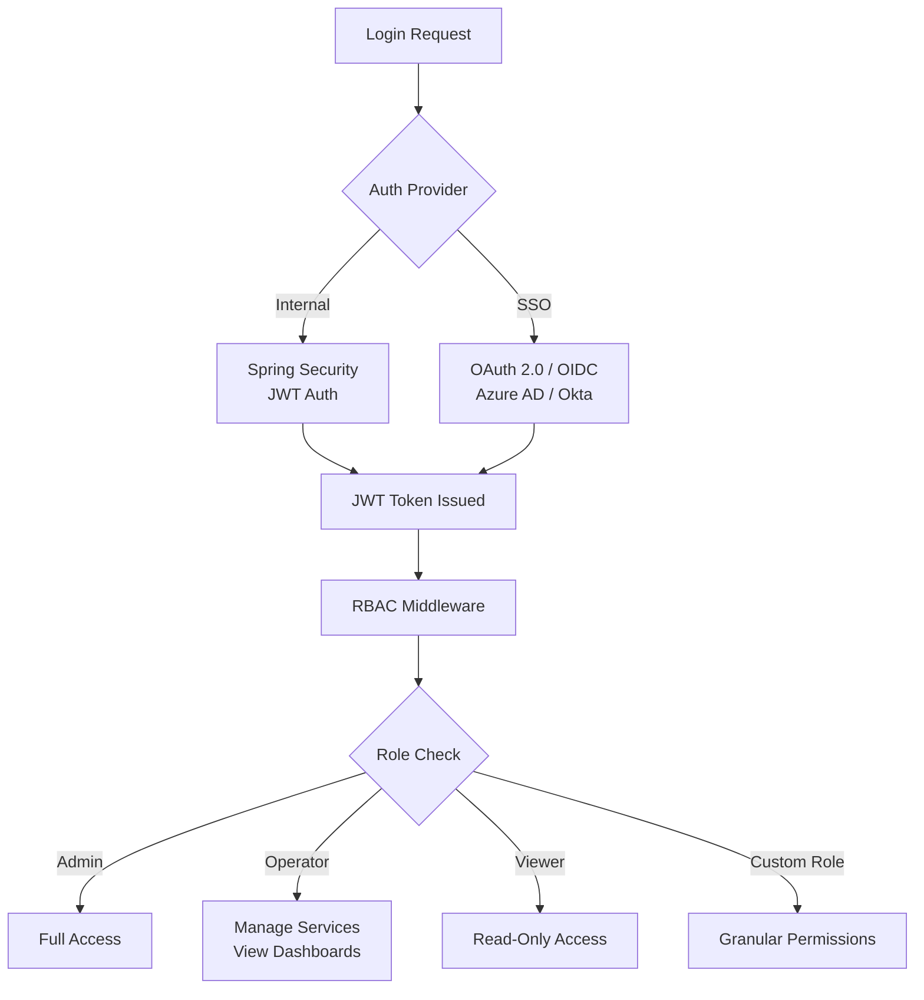
```mermaid
flowchart TD
    A[Login Request] --> B{Auth Provider}
    B -->|Internal| C[Spring Security<br>JWT Auth]
    B -->|SSO| D[OAuth 2.0 / OIDC<br>Azure AD / Okta]
    C & D --> E[JWT Token Issued]
    E --> F[RBAC Middleware]
    F --> G{Role Check}
    G -->|Admin| H[Full Access]
    G -->|Operator| I[Manage Services<br>View Dashboards]
    G -->|Viewer| J[Read-Only Access]
    G -->|Custom Role| K[Granular Permissions]
```

#### Authentication

- **Primary:** JWT-based authentication via Spring Security.
- **SSO Integration:** OAuth 2.0 / OpenID Connect with Azure AD, Okta, or any OIDC provider.
- **Token Lifecycle:** Access token (15 min) + refresh token (7 days) with rotation.

#### Roles & Permissions (RBAC)

| Role        | Description                                                      |
|-------------|------------------------------------------------------------------|
| Admin       | Full platform access — user management, global config, all data  |
| Operator    | Enable/disable services, manage SLA, configure alerts            |
| Viewer      | Read-only dashboards, logs, traces, reports                      |
| Custom Role | Fine-grained permission sets configurable by Admin               |

#### Permission Matrix (Sample)

| Permission                | Admin | Operator | Viewer |
|---------------------------|:-----:|:--------:|:------:|
| Manage Users              |  ✅   |    ❌    |   ❌   |
| Create/Edit Roles         |  ✅   |    ❌    |   ❌   |
| Enable/Disable Services   |  ✅   |    ✅    |   ❌   |
| Configure SLA/Alerts      |  ✅   |    ✅    |   ❌   |
| View Dashboards           |  ✅   |    ✅    |   ✅   |
| Create Custom Dashboards  |  ✅   |    ✅    |   ❌   |
| Download Reports          |  ✅   |    ✅    |   ✅   |
| AI Suggestions Access     |  ✅   |    ✅    |   ✅   |

---

### 6.2 APM Management

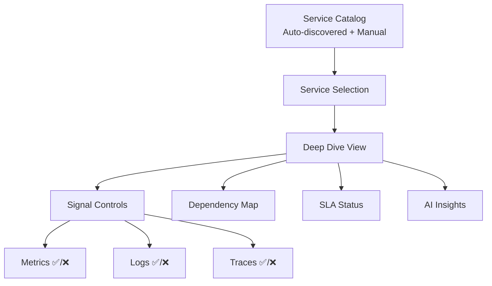
```mermaid
flowchart TD
    SC[Service Catalog<br>Auto-discovered + Manual]
    SC --> SS[Service Selection]
    SS --> DD[Deep Dive View]
    DD --> SIG[Signal Controls]
    SIG --> M[Metrics ✅/❌]
    SIG --> L[Logs ✅/❌]
    SIG --> T[Traces ✅/❌]

    DD --> DEP[Dependency Map]
    DD --> SLA[SLA Status]
    DD --> AI[AI Insights]
```

#### Service & Application Catalog

- **Auto-Discovery:** Services are auto-registered when the OTel Collector first receives telemetry bearing a new `service.name` resource attribute.
- **Manual Registration:** Operators can also manually register services, assign ownership, and tag with metadata (team, environment, tier).
- **Service Deep Dive:** Selecting a service opens a consolidated view showing health score, active alerts, key metrics (latency P50/P95/P99, error rate, throughput), recent logs, and sample traces.

#### Enable / Disable Controls

| Control Level         | Description                                                    |
|-----------------------|----------------------------------------------------------------|
| Service-level toggle  | Completely enable or disable monitoring for a service          |
| Signal-level toggle   | Independently enable/disable Metrics, Logs, or Traces per service |

Disabling a signal instructs the OTel Collector (via config reload or control-plane API) to drop data for that service + signal combination at the processor layer, saving storage and cost.

---

### 6.3 Metrics

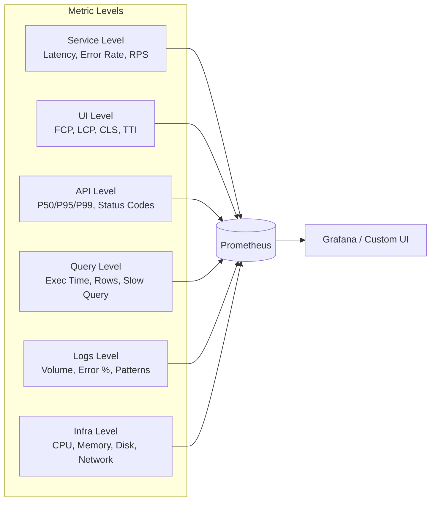
```mermaid
flowchart LR
    subgraph Metric Levels
        SVC[Service Level<br>Latency, Error Rate, RPS]
        UIL[UI Level<br>FCP, LCP, CLS, TTI]
        APIL[API Level<br>P50/P95/P99, Status Codes]
        QRY[Query Level<br>Exec Time, Rows, Slow Query]
        LOG[Logs Level<br>Volume, Error %, Patterns]
        INF[Infra Level<br>CPU, Memory, Disk, Network]
    end

    SVC & UIL & APIL & QRY & LOG & INF --> PR[(Prometheus)]
    PR --> GF[Grafana / Custom UI]
```

#### Metric Breakdown by Level

| Level          | Key Metrics                                                                 | Source                  |
|----------------|-----------------------------------------------------------------------------|-------------------------|
| **Service**    | Request rate, error rate, latency (P50/P95/P99), saturation                 | OTel SDK + Prometheus   |
| **UI**         | First Contentful Paint, Largest Contentful Paint, CLS, Time to Interactive  | OTel Browser SDK        |
| **API**        | Per-endpoint latency histogram, status code distribution, throughput        | OTel SDK instrumentation|
| **Query**      | SQL execution time, rows scanned vs returned, slow-query flag               | JDBC instrumentation    |
| **Logs**       | Log volume per service/level, error log ratio, pattern frequency            | Elasticsearch aggregation|
| **Infra**      | CPU %, memory %, disk I/O, network bytes in/out, GC pause time             | Node exporter / cAdvisor|

All metrics are stored in **Prometheus** using the `remote_write` exporter from the OTel Collector. PromQL is the query language exposed via the backend API to the React UI.

---

### 6.4 Logs

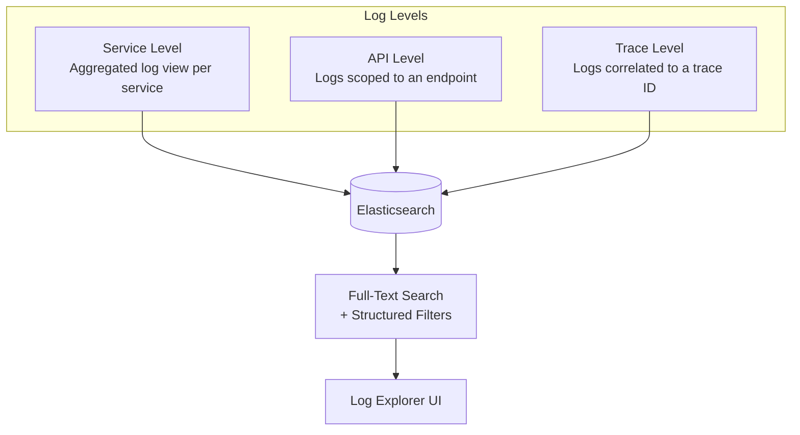
```mermaid
flowchart TD
    subgraph Log Levels
        SL[Service Level<br>Aggregated log view per service]
        AL[API Level<br>Logs scoped to an endpoint]
        TL[Trace Level<br>Logs correlated to a trace ID]
    end

    SL & AL & TL --> ES[(Elasticsearch)]
    ES --> Q[Full-Text Search<br>+ Structured Filters]
    Q --> UI[Log Explorer UI]
```

#### Log Capabilities

- **Service-Level Logs:** Filterable by service name, environment, severity, and time range. Supports full-text search via Elasticsearch.
- **API-Level Logs:** Scoped to a specific HTTP route/method; useful for debugging individual endpoints.
- **Trace-Level Logs:** All log entries tagged with a given `traceId` are displayed together, providing causal context when diagnosing a distributed request.

#### Log Enrichment

Logs emitted through the OTel SDK are automatically enriched with `traceId`, `spanId`, `service.name`, `deployment.environment`, and custom resource attributes before being indexed in Elasticsearch.

---

### 6.5 Traces

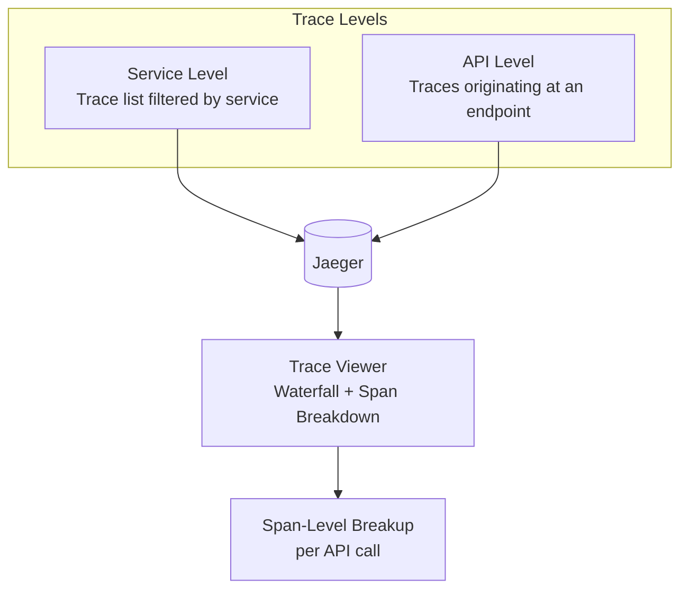
```mermaid
flowchart TD
    subgraph Trace Levels
        ST[Service Level<br>Trace list filtered by service]
        AT[API Level<br>Traces originating at an endpoint]
    end

    ST & AT --> JG[(Jaeger)]
    JG --> TV[Trace Viewer<br>Waterfall + Span Breakdown]
    TV --> SB[Span-Level Breakup<br>per API call]
```

#### Trace Capabilities

| Capability              | Description                                                              |
|-------------------------|--------------------------------------------------------------------------|
| Service-level traces    | List all traces passing through a service; filter by duration, error     |
| API-level traces        | Filter traces originating from or touching a specific endpoint           |
| Span-level breakup      | Waterfall view showing every span within a trace — service, operation, duration, status |
| Cross-service correlation | Trace context propagation (W3C TraceContext) across HTTP and gRPC calls |

Jaeger is used as the trace backend, with **Elasticsearch** as the storage engine. The Spring Boot backend exposes Jaeger Query API results to the React UI via a dedicated Trace Service.

---

### 6.6 SLA Setup & KPI Alerting

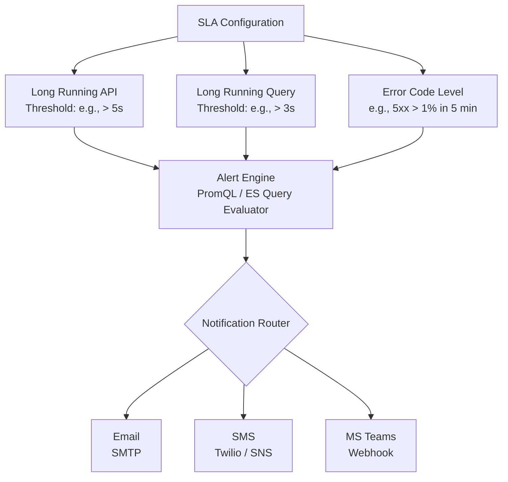
```mermaid
flowchart TD
    SLA[SLA Configuration]
    SLA --> LR[Long Running API<br>Threshold: e.g., > 5s]
    SLA --> LQ[Long Running Query<br>Threshold: e.g., > 3s]
    SLA --> EC[Error Code Level<br>e.g., 5xx > 1% in 5 min]

    LR & LQ & EC --> AE[Alert Engine<br>PromQL / ES Query Evaluator]
    AE --> NF{Notification Router}
    NF --> EM[Email<br>SMTP]
    NF --> SMS[SMS<br>Twilio / SNS]
    NF --> TM[MS Teams<br>Webhook]
```

#### SLA Definition Model

```
SLA Rule {
    id, name, service, signal_type,
    condition_expression,   // e.g., "p99_latency > 5000ms"
    evaluation_window,      // e.g., "5m"
    severity,               // CRITICAL | WARNING | INFO
    notification_channels[] // [EMAIL, SMS, TEAMS]
}
```

#### KPI Alerting Flow

1. **Rule Evaluation:** The Alert Engine runs PromQL range queries (metrics) or Elasticsearch aggregations (logs) on a configurable interval (default: 60 s).
2. **State Machine:** Each rule transitions through `OK → PENDING → FIRING → RESOLVED`.
3. **Notification Dispatch:** Firing alerts are routed to configured channels (Email via SMTP, SMS via Twilio/SNS, MS Teams via incoming webhook).
4. **De-duplication & Grouping:** Alerts with the same labels are grouped to prevent notification storms.

---

### 6.7 Dependency Metrics

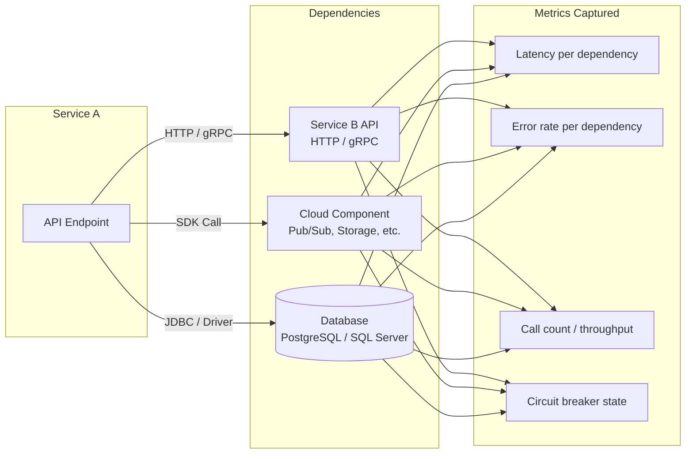
```mermaid
flowchart LR
    subgraph Service A
        A_API[API Endpoint]
    end

    subgraph Dependencies
        B_API[Service B API<br>HTTP / gRPC]
        CLD[Cloud Component<br>Pub/Sub, Storage, etc.]
        DB[(Database<br>PostgreSQL / SQL Server)]
    end

    A_API -->|HTTP / gRPC| B_API
    A_API -->|SDK Call| CLD
    A_API -->|JDBC / Driver| DB

    subgraph Metrics Captured
        M1[Latency per dependency]
        M2[Error rate per dependency]
        M3[Call count / throughput]
        M4[Circuit breaker state]
    end

    B_API & CLD & DB --> M1 & M2 & M3 & M4
```

#### Dependency Types & Metrics

| Dependency Type           | Protocols       | Key Metrics                                            |
|---------------------------|-----------------|--------------------------------------------------------|
| API → API                 | HTTP, gRPC      | Latency, error rate, status codes, throughput          |
| API → Cloud Components    | SDK (Pub/Sub, Storage, etc.) | Latency, error rate, throttling, message lag   |
| API → Database            | JDBC, R2DBC     | Query time, connection pool usage, error rate          |

Dependency data is extracted from **span attributes** in traces. The OTel SDK's HTTP and gRPC client instrumentation records `peer.service`, `db.system`, `rpc.method`, and similar attributes that the platform uses to build a dynamic dependency graph.

---

### 6.8 Workflow Configuration (Marker)

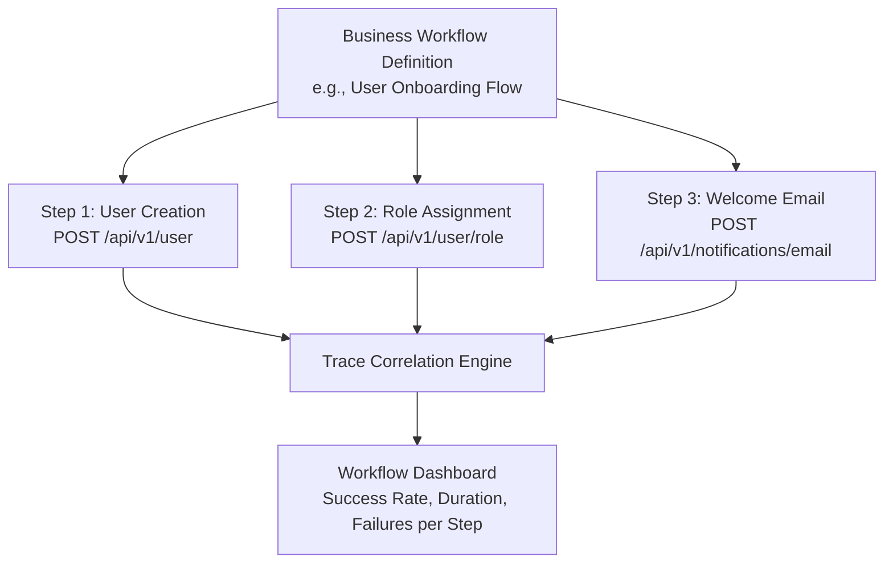
```mermaid
flowchart TD
    BW[Business Workflow Definition<br>e.g., User Onboarding Flow]

    BW --> S1[Step 1: User Creation<br>POST /api/v1/user]
    BW --> S2[Step 2: Role Assignment<br>POST /api/v1/user/role]
    BW --> S3[Step 3: Welcome Email<br>POST /api/v1/notifications/email]

    S1 & S2 & S3 --> TC[Trace Correlation Engine]
    TC --> WFD[Workflow Dashboard<br>Success Rate, Duration, Failures per Step]
```

#### Concept

The **Marker** module allows operators to define **business workflows** as an ordered set of API endpoints spanning one or more services. The platform then correlates technical traces to these workflows, enabling business-level observability.

#### Workflow Definition Model

```
Workflow {
    id, name, description, owner_team,
    steps: [
        { order: 1, service: "user-service",   method: "POST", path: "/api/v1/user",              label: "User Creation" },
        { order: 2, service: "user-service",   method: "POST", path: "/api/v1/user/role",          label: "Role Assignment" },
        { order: 3, service: "notification-svc", method: "POST", path: "/api/v1/notifications/email", label: "Welcome Email" }
    ],
    sla: { max_duration_ms: 10000, max_error_rate_pct: 1 }
}
```

#### Correlation Logic

1. When a trace enters Step 1's endpoint, a workflow instance is opened.
2. Subsequent spans matching Step 2, Step 3 (by `service.name` + `http.route`) within the same trace are mapped to the workflow.
3. Incomplete or failed workflows are flagged for alerting.

#### Workflow Dashboard

- End-to-end success rate and latency.
- Per-step latency contribution (stacked bar).
- Failed workflow instances with root-cause step highlighted.

---

### 6.9 Dashboards

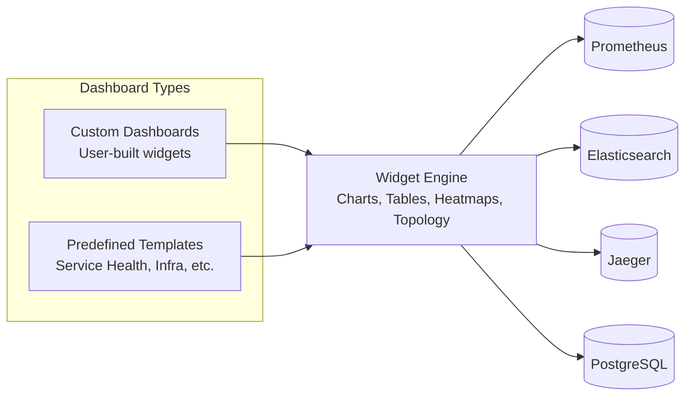
```mermaid
flowchart LR
    subgraph Dashboard Types
        CD[Custom Dashboards<br>User-built widgets]
        PD[Predefined Templates<br>Service Health, Infra, etc.]
    end

    CD --> WE[Widget Engine<br>Charts, Tables, Heatmaps, Topology]
    PD --> WE
    WE --> PR[(Prometheus)]
    WE --> ES[(Elasticsearch)]
    WE --> JG[(Jaeger)]
    WE --> PG[(PostgreSQL)]
```

#### Dashboard Capabilities

| Feature                 | Description                                                                |
|-------------------------|----------------------------------------------------------------------------|
| Custom Dashboards       | Drag-and-drop widget builder; supports time-series, bar, pie, table, heatmap, topology map widgets |
| Predefined Templates    | Out-of-the-box templates for Service Health, Infrastructure, API Performance, Database Health |
| Data Sources            | PromQL (metrics), ES queries (logs), Jaeger queries (traces), PostgreSQL (config data) |
| Variables & Filters     | Template variables for service, environment, time range — apply across all widgets |
| Sharing & Embedding     | Dashboards can be shared via URL or embedded in external portals (iframe)  |

---

### 6.10 Reports

| Report Type         | Content                                                                            | Schedule           |
|---------------------|------------------------------------------------------------------------------------|--------------------|
| **KPI Reports**     | SLA compliance %, alert count by severity, top offending services, trend analysis  | Daily / Weekly     |
| **Performance Reports** | P50/P95/P99 latency trends, throughput, error budgets, infra utilisation      | Weekly / Monthly   |

Reports are generated as PDFs by the Report Service (Spring Boot) using data aggregated from Prometheus and Elasticsearch and stored temporarily in the platform. Scheduled delivery via email is configurable.

---

### 6.11 Synthetic Monitoring

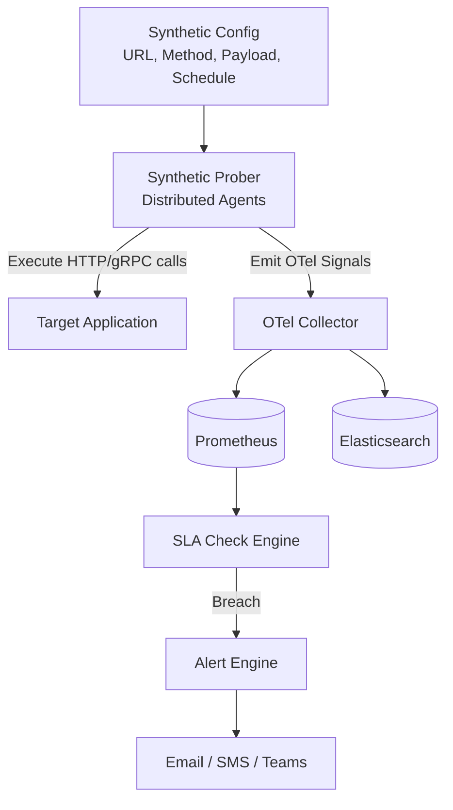
```mermaid
flowchart TD
    SC[Synthetic Config<br>URL, Method, Payload, Schedule]
    SC --> SP[Synthetic Prober<br>Distributed Agents]
    SP -->|Execute HTTP/gRPC calls| TGT[Target Application]
    SP -->|Emit OTel Signals| OC[OTel Collector]

    OC --> PR[(Prometheus)]
    OC --> ES[(Elasticsearch)]

    PR --> SLA_CHK[SLA Check Engine]
    SLA_CHK -->|Breach| ALR[Alert Engine]
    ALR --> NC[Email / SMS / Teams]
```

#### Synthetic Monitoring Features

| Feature                     | Description                                                          |
|-----------------------------|----------------------------------------------------------------------|
| Application Monitoring      | Scheduled HTTP/gRPC probes against application endpoints             |
| Multi-location Probes       | Probe agents deployed in different regions for geo-availability      |
| SLA Attachment              | Each synthetic check can be bound to an SLA rule with alerting       |
| Response Validation         | Assert on status code, response body, latency threshold              |
| OTel-native                 | Probe results are emitted as OTel metrics and traces for correlation |

---

### 6.12 AI Capabilities

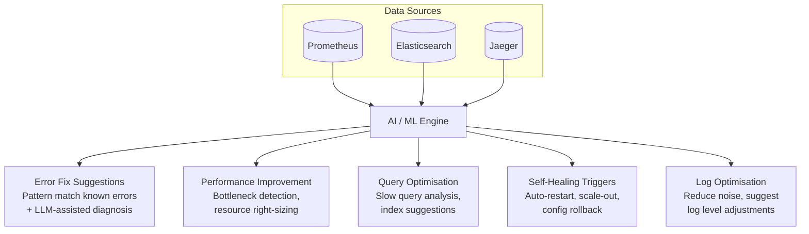
```mermaid
flowchart TD
    subgraph Data Sources
        PR[(Prometheus)]
        ES[(Elasticsearch)]
        JG[(Jaeger)]
    end

    PR & ES & JG --> AI_ENG[AI / ML Engine]

    AI_ENG --> ERR[Error Fix Suggestions<br>Pattern match known errors<br>+ LLM-assisted diagnosis]
    AI_ENG --> PERF[Performance Improvement<br>Bottleneck detection,<br>resource right-sizing]
    AI_ENG --> QO[Query Optimisation<br>Slow query analysis,<br>index suggestions]
    AI_ENG --> SH[Self-Healing Triggers<br>Auto-restart, scale-out,<br>config rollback]
    AI_ENG --> LO[Log Optimisation<br>Reduce noise, suggest<br>log level adjustments]
```

#### AI Feature Breakdown

| Feature                     | Approach                                                                                    |
|-----------------------------|---------------------------------------------------------------------------------------------|
| Error Fix Suggestions       | Match error signatures against a knowledge base; optionally invoke an LLM for root-cause explanation |
| Performance Improvement     | Statistical anomaly detection on latency/throughput; bottleneck attribution via trace span analysis |
| Query Optimisation          | Analyse slow-query logs; suggest missing indexes, query rewrites, connection pool tuning     |
| Self-Healing Triggers       | Automated runbooks: restart pod, scale replicas, toggle feature flag, rollback config change |
| Log Optimisation            | Identify high-volume, low-value log lines; recommend log-level adjustments per package      |

Self-healing actions are executed only after operator approval unless explicitly configured for auto-execution.

---

### 6.13 AI/ML Monitoring

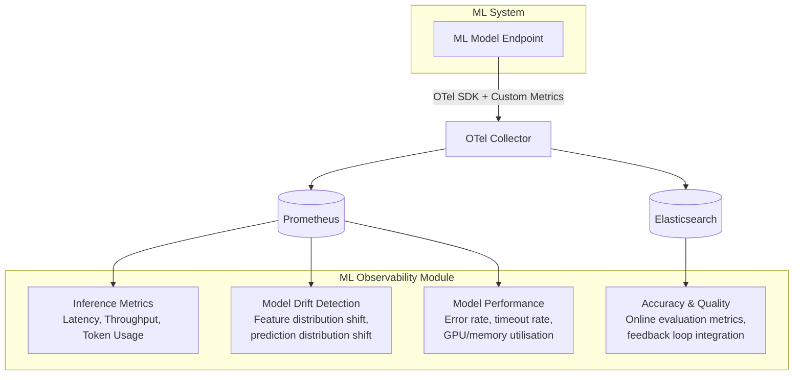
```mermaid
flowchart TD
    subgraph ML System
        MLE[ML Model Endpoint]
    end

    MLE -->|OTel SDK + Custom Metrics| OC[OTel Collector]

    OC --> PR[(Prometheus)]
    OC --> ES[(Elasticsearch)]

    subgraph ML Observability Module
        INF[Inference Metrics<br>Latency, Throughput, Token Usage]
        DRF[Model Drift Detection<br>Feature distribution shift,<br>prediction distribution shift]
        ACC[Accuracy & Quality<br>Online evaluation metrics,<br>feedback loop integration]
        MPM[Model Performance<br>Error rate, timeout rate,<br>GPU/memory utilisation]
    end

    PR --> INF & DRF & MPM
    ES --> ACC
```

#### AI/ML Monitoring Capabilities

| Capability                 | Metrics / Signals                                                              |
|----------------------------|--------------------------------------------------------------------------------|
| Model Performance          | Inference latency P50/P95/P99, error rate, throughput, GPU utilisation         |
| Inference Metrics          | Token count (input/output), batch size, queue depth, cold-start latency       |
| Model Drift Detection      | Feature distribution divergence (KL, PSI), prediction confidence distribution |
| Accuracy & Quality         | Online accuracy, F1, BLEU (for generative models), user feedback scores       |

Drift detection runs as a scheduled job comparing recent inference feature distributions against a baseline window. Alerts fire when divergence exceeds configurable thresholds.

---

## 7. Data Flow Architecture

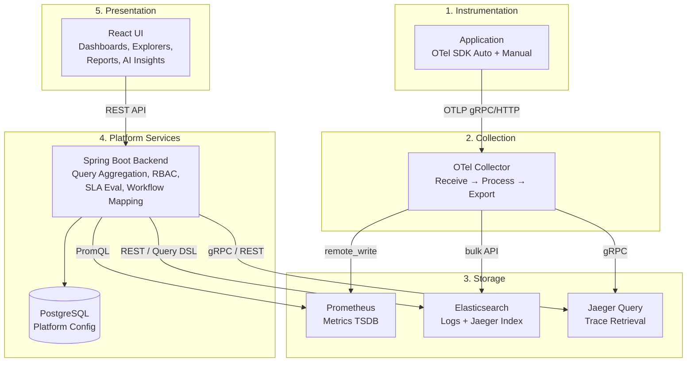
```mermaid
flowchart TB
    subgraph 1. Instrumentation
        APP[Application<br>OTel SDK Auto + Manual]
    end

    subgraph 2. Collection
        OTEL[OTel Collector<br>Receive → Process → Export]
    end

    subgraph 3. Storage
        PROM[Prometheus<br>Metrics TSDB]
        ELAS[Elasticsearch<br>Logs + Jaeger Index]
        JAEG[Jaeger Query<br>Trace Retrieval]
    end

    subgraph 4. Platform Services
        BK[Spring Boot Backend<br>Query Aggregation, RBAC,<br>SLA Eval, Workflow Mapping]
        PG[(PostgreSQL<br>Platform Config)]
    end

    subgraph 5. Presentation
        RUI[React UI<br>Dashboards, Explorers,<br>Reports, AI Insights]
    end

    APP -->|OTLP gRPC/HTTP| OTEL
    OTEL -->|remote_write| PROM
    OTEL -->|bulk API| ELAS
    OTEL -->|gRPC| JAEG

    BK -->|PromQL| PROM
    BK -->|REST / Query DSL| ELAS
    BK -->|gRPC / REST| JAEG
    BK --> PG

    RUI -->|REST API| BK
```

---

## 8. Database Schema Design (Logical)

The following ERD covers the **PostgreSQL** schema for platform configuration. Telemetry data resides in Prometheus, Elasticsearch, and Jaeger — not in PostgreSQL.

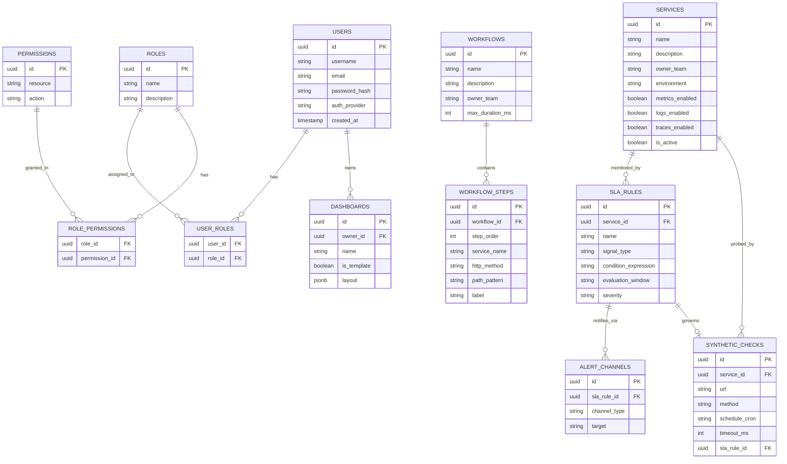
```mermaid
erDiagram
    USERS {
        uuid id PK
        string username
        string email
        string password_hash
        string auth_provider
        timestamp created_at
    }

    ROLES {
        uuid id PK
        string name
        string description
    }

    PERMISSIONS {
        uuid id PK
        string resource
        string action
    }

    ROLE_PERMISSIONS {
        uuid role_id FK
        uuid permission_id FK
    }

    USER_ROLES {
        uuid user_id FK
        uuid role_id FK
    }

    SERVICES {
        uuid id PK
        string name
        string description
        string owner_team
        string environment
        boolean metrics_enabled
        boolean logs_enabled
        boolean traces_enabled
        boolean is_active
    }

    SLA_RULES {
        uuid id PK
        uuid service_id FK
        string name
        string signal_type
        string condition_expression
        string evaluation_window
        string severity
    }

    ALERT_CHANNELS {
        uuid id PK
        uuid sla_rule_id FK
        string channel_type
        string target
    }

    WORKFLOWS {
        uuid id PK
        string name
        string description
        string owner_team
        int max_duration_ms
    }

    WORKFLOW_STEPS {
        uuid id PK
        uuid workflow_id FK
        int step_order
        string service_name
        string http_method
        string path_pattern
        string label
    }

    DASHBOARDS {
        uuid id PK
        uuid owner_id FK
        string name
        boolean is_template
        jsonb layout
    }

    SYNTHETIC_CHECKS {
        uuid id PK
        uuid service_id FK
        string url
        string method
        string schedule_cron
        int timeout_ms
        uuid sla_rule_id FK
    }

    USERS ||--o{ USER_ROLES : has
    ROLES ||--o{ USER_ROLES : assigned_to
    ROLES ||--o{ ROLE_PERMISSIONS : has
    PERMISSIONS ||--o{ ROLE_PERMISSIONS : granted_in
    SERVICES ||--o{ SLA_RULES : monitored_by
    SLA_RULES ||--o{ ALERT_CHANNELS : notifies_via
    WORKFLOWS ||--o{ WORKFLOW_STEPS : contains
    USERS ||--o{ DASHBOARDS : owns
    SERVICES ||--o{ SYNTHETIC_CHECKS : probed_by
    SLA_RULES ||--o| SYNTHETIC_CHECKS : governs
```

---

## 9. API Design Overview

All APIs follow REST conventions and are versioned under `/api/v1/`. Authentication is via Bearer JWT token. Below is a representative (non-exhaustive) listing.

### User Management APIs

| Method | Endpoint                        | Description                    |
|--------|---------------------------------|--------------------------------|
| POST   | `/api/v1/auth/login`            | Authenticate and receive JWT   |
| POST   | `/api/v1/auth/refresh`          | Refresh access token           |
| GET    | `/api/v1/users`                 | List users (Admin)             |
| POST   | `/api/v1/users`                 | Create user                    |
| PUT    | `/api/v1/users/{id}`            | Update user                    |
| GET    | `/api/v1/roles`                 | List roles                     |
| POST   | `/api/v1/roles`                 | Create custom role             |
| PUT    | `/api/v1/roles/{id}/permissions`| Update role permissions        |

### APM & Service APIs

| Method | Endpoint                                  | Description                           |
|--------|-------------------------------------------|---------------------------------------|
| GET    | `/api/v1/services`                        | List all registered services          |
| GET    | `/api/v1/services/{id}`                   | Service detail with health summary    |
| PATCH  | `/api/v1/services/{id}/signals`           | Enable/disable metrics/logs/traces    |
| GET    | `/api/v1/services/{id}/metrics`           | Query metrics for a service           |
| GET    | `/api/v1/services/{id}/logs`              | Query logs for a service              |
| GET    | `/api/v1/services/{id}/traces`            | Query traces for a service            |
| GET    | `/api/v1/services/{id}/dependencies`      | Dependency graph and metrics          |

### SLA, Alerting & Workflow APIs

| Method | Endpoint                                  | Description                           |
|--------|-------------------------------------------|---------------------------------------|
| POST   | `/api/v1/sla-rules`                       | Create SLA rule                       |
| GET    | `/api/v1/sla-rules`                       | List SLA rules                        |
| GET    | `/api/v1/alerts`                          | List active and historical alerts     |
| POST   | `/api/v1/workflows`                       | Define a business workflow            |
| GET    | `/api/v1/workflows/{id}/instances`        | List workflow execution instances     |

### Dashboard, Report & Synthetic APIs

| Method | Endpoint                                  | Description                           |
|--------|-------------------------------------------|---------------------------------------|
| POST   | `/api/v1/dashboards`                      | Create custom dashboard               |
| GET    | `/api/v1/dashboards/templates`            | List predefined templates             |
| POST   | `/api/v1/reports/generate`                | Trigger report generation             |
| POST   | `/api/v1/synthetic-checks`                | Create synthetic check                |

### AI APIs

| Method | Endpoint                                  | Description                           |
|--------|-------------------------------------------|---------------------------------------|
| GET    | `/api/v1/ai/error-suggestions/{traceId}` | Get error fix suggestions             |
| GET    | `/api/v1/ai/perf-suggestions/{serviceId}`| Get performance recommendations       |
| GET    | `/api/v1/ai/query-suggestions`            | Get query optimisation advice         |
| POST   | `/api/v1/ai/self-heal/{serviceId}`        | Trigger self-healing action           |

---

## 10. Security Architecture

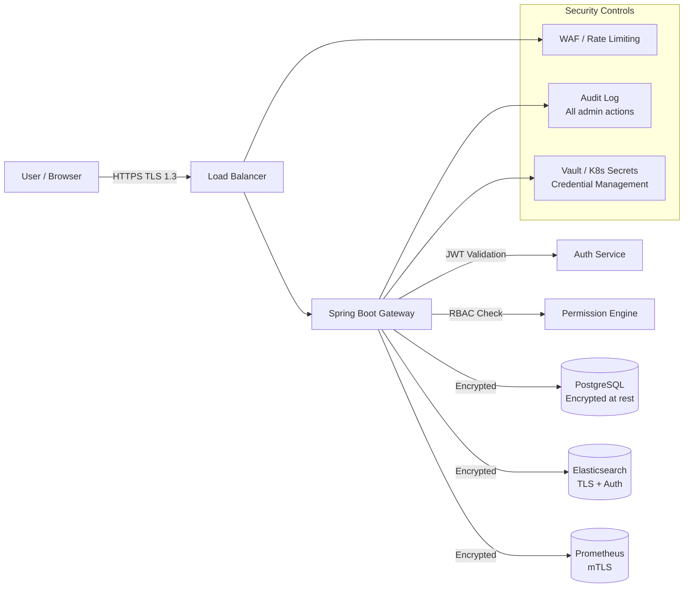
```mermaid
flowchart LR
    U[User / Browser] -->|HTTPS TLS 1.3| LB[Load Balancer]
    LB --> API[Spring Boot Gateway]
    API -->|JWT Validation| AUTH[Auth Service]
    API -->|RBAC Check| RBAC[Permission Engine]
    API -->|Encrypted| PG[(PostgreSQL<br>Encrypted at rest)]
    API -->|Encrypted| ES[(Elasticsearch<br>TLS + Auth)]
    API -->|Encrypted| PR[(Prometheus<br>mTLS)]

    subgraph Security Controls
        WAF[WAF / Rate Limiting]
        AUDIT[Audit Log<br>All admin actions]
        SECRETS[Vault / K8s Secrets<br>Credential Management]
    end

    LB --> WAF
    API --> AUDIT
    API --> SECRETS
```

### Key Security Measures

| Area                     | Implementation                                              |
|--------------------------|-------------------------------------------------------------|
| Transport                | TLS 1.3 everywhere; mTLS between internal services          |
| Authentication           | JWT + OAuth 2.0 / OIDC; MFA for admin accounts             |
| Authorization            | RBAC enforced at API gateway level                          |
| Data at Rest             | PostgreSQL TDE, Elasticsearch encryption at rest            |
| Secrets Management       | HashiCorp Vault or Kubernetes Secrets (sealed)              |
| Audit Logging            | All user/admin actions logged to a dedicated audit index    |
| Rate Limiting            | Per-user and per-IP rate limits at gateway                  |
| Input Validation         | Request schema validation, SQL injection prevention         |

---

## 11. Deployment Architecture

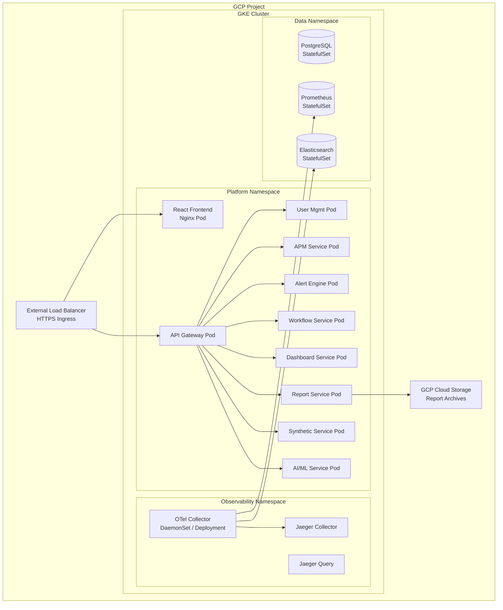
```mermaid
flowchart TD
    subgraph GCP Project
        subgraph GKE Cluster
            subgraph Platform Namespace
                FE[React Frontend<br>Nginx Pod]
                GW[API Gateway Pod]
                SVC1[User Mgmt Pod]
                SVC2[APM Service Pod]
                SVC3[Alert Engine Pod]
                SVC4[Workflow Service Pod]
                SVC5[Dashboard Service Pod]
                SVC6[Report Service Pod]
                SVC7[Synthetic Service Pod]
                SVC8[AI/ML Service Pod]
            end

            subgraph Observability Namespace
                OTEL[OTel Collector<br>DaemonSet / Deployment]
                JAEG_Q[Jaeger Query]
                JAEG_C[Jaeger Collector]
            end

            subgraph Data Namespace
                PG_SS[(PostgreSQL<br>StatefulSet)]
                PROM_SS[(Prometheus<br>StatefulSet)]
                ES_SS[(Elasticsearch<br>StatefulSet)]
            end
        end

        GCS[GCP Cloud Storage<br>Report Archives]
        LB_EXT[External Load Balancer<br>HTTPS Ingress]
    end

    LB_EXT --> FE & GW
    GW --> SVC1 & SVC2 & SVC3 & SVC4 & SVC5 & SVC6 & SVC7 & SVC8
    OTEL --> PROM_SS & ES_SS & JAEG_C
    SVC6 --> GCS
```

### Deployment Highlights

- **Container Orchestration:** GKE (Google Kubernetes Engine) with auto-scaling node pools.
- **OTel Collector:** Deployed as a DaemonSet (for node-level host metrics) plus a Deployment (for gateway collector).
- **StatefulSets:** Prometheus, Elasticsearch, and PostgreSQL run as StatefulSets with persistent volumes.
- **CI/CD:** GitHub Actions / Cloud Build pipelines with Helm chart deployments.
- **Environments:** Dev → Staging → Production with namespace isolation.

---

## 12. Scalability & Performance Considerations

| Concern                 | Strategy                                                                        |
|-------------------------|---------------------------------------------------------------------------------|
| Telemetry Ingestion     | Horizontally scale OTel Collector pods; L4 LB distributes gRPC connections      |
| Metrics Cardinality     | Enforce label cardinality limits in Prometheus; use recording rules for hot queries |
| Log Volume              | Index lifecycle management (ILM) in Elasticsearch — hot → warm → cold → delete |
| Trace Sampling          | Tail-based sampling in OTel Collector to retain error/slow traces at higher rate |
| API Performance         | Read replicas for PostgreSQL; Redis cache for hot dashboard queries              |
| Frontend                | Code splitting, lazy loading, and CDN for static assets                         |
| Alert Engine            | Partition SLA rules across worker pods for parallel evaluation                  |
| Report Generation       | Async generation via task queue; PDF rendering off-main-thread                  |

---

## 13. Appendix

### A. Glossary

| Term             | Definition                                                          |
|------------------|---------------------------------------------------------------------|
| APM              | Application Performance Monitoring                                  |
| OTel             | OpenTelemetry — vendor-neutral observability framework              |
| SLA              | Service Level Agreement                                             |
| KPI              | Key Performance Indicator                                           |
| RBAC             | Role-Based Access Control                                           |
| Marker           | Business workflow mapping module in this platform                   |
| Synthetic Check  | Automated probe that simulates user requests on a schedule          |
| Tail Sampling    | Sampling strategy that makes retain/drop decisions after a trace completes |

### B. Reference Documents

| Document                                  | Purpose                                |
|-------------------------------------------|----------------------------------------|
| OpenTelemetry Specification               | Signal semantics and protocol details  |
| Jaeger Architecture                       | Trace storage and querying internals   |
| Prometheus Data Model                     | Metric types, labels, PromQL           |
| Elasticsearch Index Lifecycle Management  | Data retention and tiering policies    |
| Spring Security OAuth 2.0 Resource Server | JWT validation and RBAC integration    |

---

*End of Document*
