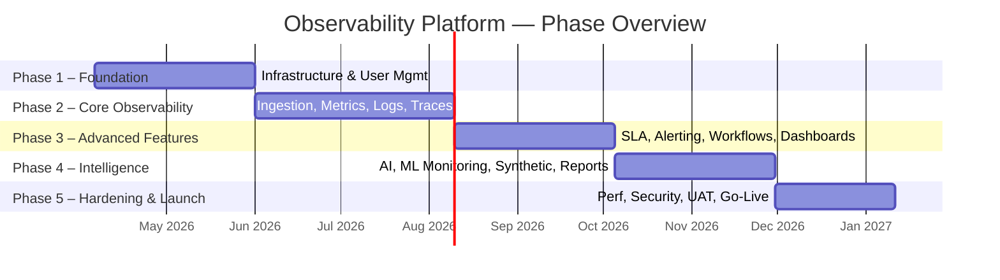
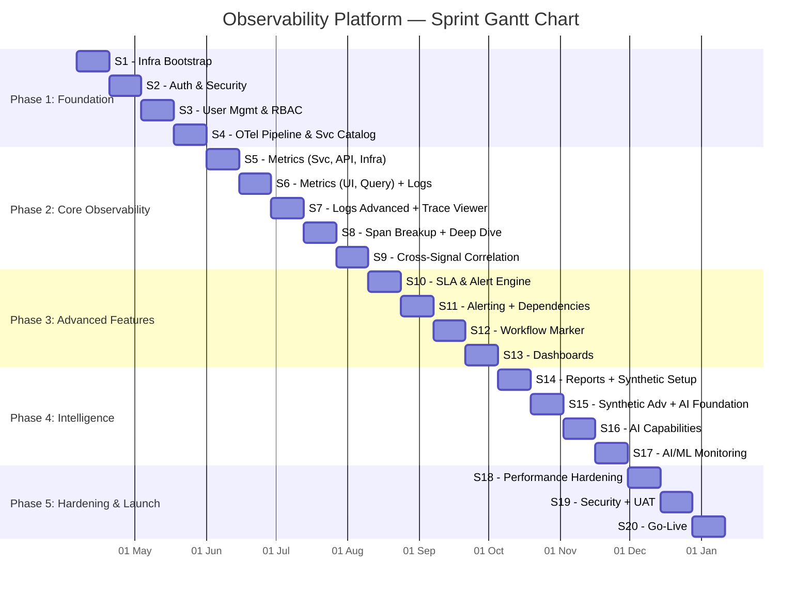
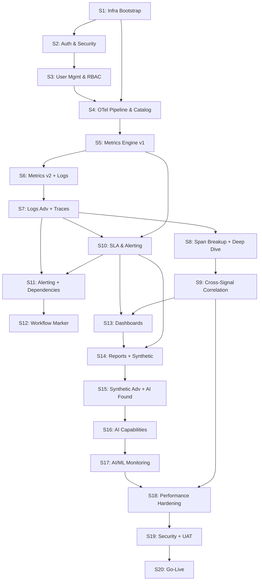
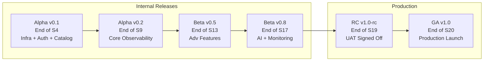

# Observability Platform — Sprint Project Plan

| Field          | Detail                                         |
|----------------|-------------------------------------------------|
| **Document**   | Sprint-Based Project Plan                       |
| **Version**    | 1.0                                             |
| **Date**       | March 15, 2026                                  |
| **Reference**  | Observability Platform HLD v1.0                 |
| **Sprint Duration** | 2 Weeks (10 working days)                  |
| **Total Sprints**   | 20 Sprints (~40 Weeks / 10 Months)         |
| **Team Size**       | ~21 members (Developers, Testers, BAs)     |

---

## Table of Contents

1. [Project Overview](#1-project-overview)
2. [Team Structure & Allocation](#2-team-structure--allocation)
3. [Phase & Sprint Roadmap](#3-phase--sprint-roadmap)
4. [Detailed Sprint Plan](#4-detailed-sprint-plan)
5. [Sprint-wise Gantt Chart](#5-sprint-wise-gantt-chart)
6. [Dependency Map](#6-dependency-map)
7. [Risk Register](#7-risk-register)
8. [Release Plan](#8-release-plan)
9. [Definition of Done (DoD)](#9-definition-of-done-dod)
10. [Assumptions & Constraints](#10-assumptions--constraints)

---

## 1. Project Overview

This project plan translates the Observability Platform HLD into an actionable, sprint-based execution roadmap. The platform is delivered across **5 phases** spanning **20 two-week sprints**, progressing from foundational infrastructure through core observability, advanced features, AI capabilities, and finally hardening and go-live.



---

## 2. Team Structure & Allocation

### POD Structure

The team is organised into **3 PODs** that operate in parallel, with shared BA and QA resources.

```mermaid
flowchart TD
    PM[Project Manager / Scrum Master]

    subgraph POD 1 — Platform & Infrastructure
        D1A[Backend Dev 1]
        D1B[Backend Dev 2]
        D1C[Backend Dev 3]
        D1D[DevOps / Infra Engineer]
        T1[QA Engineer 1]
    end

    subgraph POD 2 — Observability Core
        D2A[Backend Dev 4]
        D2B[Backend Dev 5]
        D2C[Backend Dev 6]
        D2D[Backend Dev 7]
        T2[QA Engineer 2]
        T3[QA Engineer 3]
    end

    subgraph POD 3 — Frontend & Intelligence
        D3A[Frontend Dev 1]
        D3B[Frontend Dev 2]
        D3C[Frontend Dev 3]
        D3D[AI/ML Engineer]
        T4[QA Engineer 4]
    end

    subgraph Shared Resources
        BA1[Business Analyst 1]
        BA2[Business Analyst 2]
        TL[Tech Lead / Architect]
    end

    PM --> POD 1 --- Platform & Infrastructure
    PM --> POD 2 --- Observability Core
    PM --> POD 3 --- Frontend & Intelligence
    BA1 & BA2 & TL --> PM
```

### Role Allocation Summary

| Role                     | Count | POD Assignment            |
|--------------------------|:-----:|---------------------------|
| Tech Lead / Architect    | 1     | Cross-POD                 |
| Backend Developers       | 7     | POD 1 (3) + POD 2 (4)    |
| Frontend Developers      | 3     | POD 3                     |
| DevOps / Infra Engineer  | 1     | POD 1                     |
| AI/ML Engineer           | 1     | POD 3                     |
| QA Engineers             | 4     | POD 1 (1) + POD 2 (2) + POD 3 (1) |
| Business Analysts        | 2     | Shared across PODs        |
| Project Manager / SM     | 1     | Cross-POD                 |
| **Total**                | **21**|                           |

---

## 3. Phase & Sprint Roadmap

| Phase | Name                         | Sprints     | Duration | Key Deliverables                                                    |
|:-----:|------------------------------|:-----------:|:--------:|---------------------------------------------------------------------|
| 1     | Foundation & Infrastructure  | S1 – S4     | 8 weeks  | GKE setup, DB schema, OTel Collector, User Mgmt, Auth, React shell  |
| 2     | Core Observability           | S5 – S9     | 10 weeks | APM catalog, Metrics engine, Logs explorer, Traces viewer, Span breakup |
| 3     | Advanced Features            | S10 – S13   | 8 weeks  | SLA/Alerting, Dependency metrics, Workflow Marker, Dashboards       |
| 4     | Intelligence & Monitoring    | S14 – S17   | 8 weeks  | AI capabilities, AI/ML monitoring, Synthetic monitoring, Reports    |
| 5     | Hardening & Go-Live          | S18 – S20   | 6 weeks  | Performance tuning, Security hardening, UAT, Production launch      |

---

## 4. Detailed Sprint Plan

---

### ━━━━━━━━━━━━━━━━━━━━━━━━━━━━━━━━━━━━━━━━━━
### PHASE 1 — FOUNDATION & INFRASTRUCTURE (Sprints 1–4)
### ━━━━━━━━━━━━━━━━━━━━━━━━━━━━━━━━━━━━━━━━━━

---

### Sprint 1 — Project Kickoff & Infrastructure Bootstrap

**Sprint Goal:** Establish development infrastructure, GKE cluster, CI/CD pipelines, and initial database schema.

| # | Story / Task | Owner POD | Story Points | Priority |
|---|-------------|:---------:|:------------:|:--------:|
| 1.1 | Set up GKE cluster with Dev and Staging namespaces (Platform, Observability, Data) | POD 1 | 8 | P0 |
| 1.2 | Provision PostgreSQL StatefulSet with Flyway migrations; create initial schema (users, roles, permissions) | POD 1 | 5 | P0 |
| 1.3 | Deploy Elasticsearch cluster (3-node) with index templates for logs and Jaeger | POD 1 | 5 | P0 |
| 1.4 | Deploy Prometheus with persistent volume and basic scrape configs | POD 1 | 3 | P0 |
| 1.5 | Deploy Jaeger (Collector + Query) with Elasticsearch backend | POD 1 | 5 | P0 |
| 1.6 | Set up CI/CD pipeline (GitHub Actions / Cloud Build) with Helm chart structure | POD 1 | 5 | P0 |
| 1.7 | Create Spring Boot parent POM, shared libraries (logging, exception handling, DTO base) | POD 2 | 5 | P0 |
| 1.8 | Scaffold React project with routing, Tailwind/MUI setup, folder structure, Storybook | POD 3 | 5 | P0 |
| 1.9 | BA: Finalise user stories for User Management and APM modules | Shared | 3 | P0 |
| 1.10 | Define API contract standards (OpenAPI 3.0 spec template, error format, pagination) | Shared | 3 | P1 |

**Sprint Velocity Target:** 47 SP

**Sprint 1 — Exit Criteria:**
- GKE cluster operational with all 3 namespaces
- PostgreSQL, Elasticsearch, Prometheus, Jaeger deployed and healthy
- CI/CD pipeline deploys a sample Spring Boot service to Dev
- React app skeleton loads in browser
- API contract template reviewed and approved

---

### Sprint 2 — User Authentication & Core Security

**Sprint Goal:** Implement JWT-based authentication, SSO integration, and the foundational security layer.

| # | Story / Task | Owner POD | Story Points | Priority |
|---|-------------|:---------:|:------------:|:--------:|
| 2.1 | Implement Auth Service: login endpoint, JWT issuance (access + refresh tokens) | POD 1 | 8 | P0 |
| 2.2 | Implement OAuth 2.0 / OIDC integration (Azure AD connector) | POD 1 | 5 | P0 |
| 2.3 | Build Spring Security filter chain: JWT validation, token refresh, expiry handling | POD 1 | 5 | P0 |
| 2.4 | Create RBAC middleware: role and permission check interceptor at gateway level | POD 1 | 5 | P0 |
| 2.5 | Design and implement audit logging framework (all admin actions → ES audit index) | POD 2 | 5 | P1 |
| 2.6 | Build React Login page, JWT token storage (httpOnly cookie), auth context provider | POD 3 | 5 | P0 |
| 2.7 | Build React Protected Route wrapper and role-based UI guard | POD 3 | 3 | P0 |
| 2.8 | API rate limiting at gateway (per-user, per-IP) | POD 2 | 3 | P1 |
| 2.9 | QA: Write auth integration tests (valid login, invalid credentials, token expiry, SSO flow) | QA | 5 | P0 |
| 2.10 | BA: Finalise user stories for Metrics and Logs modules | Shared | 3 | P1 |

**Sprint Velocity Target:** 47 SP

**Sprint 2 — Exit Criteria:**
- Users can login via username/password and receive JWT
- SSO flow with Azure AD returns valid tokens
- Protected APIs reject unauthenticated / unauthorised requests
- React login page functional with token-based session

---

### Sprint 3 — User Management & RBAC

**Sprint Goal:** Complete user CRUD operations, role/permission management, and admin UI.

| # | Story / Task | Owner POD | Story Points | Priority |
|---|-------------|:---------:|:------------:|:--------:|
| 3.1 | Implement User CRUD APIs: create, read, update, deactivate users | POD 1 | 5 | P0 |
| 3.2 | Implement Role CRUD APIs: create custom roles, assign/revoke permissions | POD 1 | 5 | P0 |
| 3.3 | Implement User-Role assignment and bulk operations API | POD 1 | 3 | P0 |
| 3.4 | Build permission matrix engine: dynamic permission evaluation from DB | POD 1 | 5 | P0 |
| 3.5 | Build React Admin → User Management page (list, create, edit, deactivate users) | POD 3 | 5 | P0 |
| 3.6 | Build React Admin → Role Management page (create role, assign permissions via checkbox matrix) | POD 3 | 5 | P0 |
| 3.7 | Build React user profile page (view own profile, change password) | POD 3 | 3 | P1 |
| 3.8 | Seed default roles (Admin, Operator, Viewer) and permissions via Flyway migration | POD 2 | 2 | P0 |
| 3.9 | QA: User management E2E tests (create user → assign role → verify access) | QA | 5 | P0 |
| 3.10 | BA: Finalise user stories for Traces and Dependency modules | Shared | 3 | P1 |

**Sprint Velocity Target:** 41 SP

**Sprint 3 — Exit Criteria:**
- Full user lifecycle (create → update → deactivate) operational
- Custom roles with granular permissions can be created and assigned
- Admin UI for user and role management complete and tested
- Default roles seeded in all environments

---

### Sprint 4 — OTel Collector Pipeline & Service Catalog Foundation

**Sprint Goal:** Deploy production-grade OTel Collector pipeline and build the Service Catalog with auto-discovery.

| # | Story / Task | Owner POD | Story Points | Priority |
|---|-------------|:---------:|:------------:|:--------:|
| 4.1 | Configure OTel Collector: OTLP receivers (gRPC :4317, HTTP :4318) | POD 1 | 5 | P0 |
| 4.2 | Configure OTel Collector processors: batch, filter, resource enrichment, tail sampling | POD 1 | 8 | P0 |
| 4.3 | Configure OTel Collector exporters: Prometheus remote_write, ES bulk, Jaeger gRPC | POD 1 | 5 | P0 |
| 4.4 | Deploy OTel Collector as DaemonSet + Gateway Deployment with L4 LB | POD 1 | 5 | P0 |
| 4.5 | Build Service Catalog API: auto-register services from OTel `service.name` attribute | POD 2 | 5 | P0 |
| 4.6 | Build manual service registration API (name, owner, team, environment, tier metadata) | POD 2 | 3 | P0 |
| 4.7 | Build signal toggle API: enable/disable metrics, logs, traces per service | POD 2 | 5 | P1 |
| 4.8 | Build React Service Catalog page: list services, search, filter by environment/team | POD 3 | 5 | P0 |
| 4.9 | Integrate a sample Spring Boot app with OTel SDK; verify end-to-end signal flow to all 3 backends | POD 2 | 5 | P0 |
| 4.10 | QA: Validate OTel pipeline — metrics in Prometheus, logs in ES, traces in Jaeger | QA | 5 | P0 |

**Sprint Velocity Target:** 51 SP

**Sprint 4 — Exit Criteria:**
- OTel Collector receiving signals via gRPC and HTTP
- Signals successfully exported to Prometheus, Elasticsearch, and Jaeger
- Service Catalog lists auto-discovered and manually registered services
- Signal toggles functional (disable metrics for a service → Prometheus stops receiving)

---

### ━━━━━━━━━━━━━━━━━━━━━━━━━━━━━━━━━━━━━━━━━━
### PHASE 2 — CORE OBSERVABILITY (Sprints 5–9)
### ━━━━━━━━━━━━━━━━━━━━━━━━━━━━━━━━━━━━━━━━━━

---

### Sprint 5 — Metrics Engine (Service, API, Infra)

**Sprint Goal:** Build the Metrics query layer and UI for service-level, API-level, and infra-level metrics.

| # | Story / Task | Owner POD | Story Points | Priority |
|---|-------------|:---------:|:------------:|:--------:|
| 5.1 | Build Metrics Service: PromQL query builder abstraction for service-level metrics (latency, error rate, RPS) | POD 2 | 8 | P0 |
| 5.2 | Implement API-level metrics endpoint: per-route latency histogram (P50/P95/P99), status code distribution | POD 2 | 5 | P0 |
| 5.3 | Implement Infra-level metrics endpoint: CPU, memory, disk I/O, network, GC pause via node-exporter / cAdvisor | POD 2 | 5 | P0 |
| 5.4 | Build time-range and resolution controls for PromQL queries | POD 2 | 3 | P1 |
| 5.5 | Build React Metrics Explorer: service selector → time-series charts (Recharts/D3) for service metrics | POD 3 | 8 | P0 |
| 5.6 | Build React API Metrics panel: endpoint dropdown → latency/throughput/error charts | POD 3 | 5 | P0 |
| 5.7 | Build React Infra Metrics panel: CPU/memory gauges, disk/network line charts | POD 3 | 5 | P0 |
| 5.8 | Deploy node-exporter DaemonSet and cAdvisor for infra metrics collection | POD 1 | 3 | P0 |
| 5.9 | QA: Validate metric accuracy — compare PromQL results against known load-test data | QA | 5 | P0 |

**Sprint Velocity Target:** 47 SP

---

### Sprint 6 — Metrics Engine (UI, Query, Logs Level) & Log Explorer Foundation

**Sprint Goal:** Complete remaining metric levels and build the foundational Log Explorer.

| # | Story / Task | Owner POD | Story Points | Priority |
|---|-------------|:---------:|:------------:|:--------:|
| 6.1 | Implement UI-level metrics endpoint: FCP, LCP, CLS, TTI from browser OTel SDK data | POD 2 | 5 | P0 |
| 6.2 | Implement Query-level metrics endpoint: SQL execution time, rows scanned, slow-query flags | POD 2 | 5 | P0 |
| 6.3 | Implement Logs-level metrics endpoint: log volume per service/level, error log ratio, pattern frequency | POD 2 | 5 | P1 |
| 6.4 | Build Log Service: Elasticsearch Query DSL abstraction for service-level log queries | POD 2 | 8 | P0 |
| 6.5 | Implement API-level log filtering: scope logs by HTTP route and method | POD 2 | 3 | P0 |
| 6.6 | Build React Web Vitals panel (FCP, LCP, CLS, TTI charts) | POD 3 | 5 | P0 |
| 6.7 | Build React Query Metrics panel: slow query table, execution time trends | POD 3 | 5 | P0 |
| 6.8 | Build React Log Explorer (v1): service filter, severity filter, time range, full-text search, log table | POD 3 | 8 | P0 |
| 6.9 | QA: End-to-end metric validation for UI, Query, and Logs levels | QA | 5 | P0 |

**Sprint Velocity Target:** 49 SP

---

### Sprint 7 — Log Explorer (Advanced) & Trace Viewer Foundation

**Sprint Goal:** Complete trace-correlated logs and build the distributed Trace Viewer.

| # | Story / Task | Owner POD | Story Points | Priority |
|---|-------------|:---------:|:------------:|:--------:|
| 7.1 | Implement trace-level log correlation: retrieve all logs matching a traceId from Elasticsearch | POD 2 | 5 | P0 |
| 7.2 | Build Trace Service: Jaeger Query API integration, service-level trace listing with filters (duration, error, time) | POD 2 | 8 | P0 |
| 7.3 | Implement API-level trace filtering: traces originating at a specific endpoint | POD 2 | 5 | P0 |
| 7.4 | Build log enrichment validation: verify traceId, spanId, service.name injection in log records | POD 1 | 3 | P0 |
| 7.5 | Build React Log → Trace link: click a traceId in log entry → navigate to Trace Viewer | POD 3 | 3 | P0 |
| 7.6 | Build React Trace Viewer (v1): trace list table, duration bar, error indicator, pagination | POD 3 | 8 | P0 |
| 7.7 | Build React Trace Detail / Waterfall view: span hierarchy, service labels, timing bars | POD 3 | 8 | P0 |
| 7.8 | QA: Trace viewer E2E — trigger known multi-service call → verify complete span tree | QA | 5 | P0 |

**Sprint Velocity Target:** 45 SP

---

### Sprint 8 — Span Breakup, Service Deep Dive & APM Overview

**Sprint Goal:** Build span-level breakup, the unified Service Deep Dive page, and APM overview.

| # | Story / Task | Owner POD | Story Points | Priority |
|---|-------------|:---------:|:------------:|:--------:|
| 8.1 | Implement span-level breakup API: decompose a trace into individual span durations, operations, and statuses | POD 2 | 5 | P0 |
| 8.2 | Build Service Deep Dive API: aggregate health score, key metrics, recent alerts, top errors for a service | POD 2 | 8 | P0 |
| 8.3 | Build APM Overview API: platform-wide service health summary, top 5 unhealthy services, signal volume stats | POD 2 | 5 | P0 |
| 8.4 | Build React Span Breakup panel: per-API span table with stacked duration bar, operation name, service tag | POD 3 | 5 | P0 |
| 8.5 | Build React Service Deep Dive page: tabbed layout (Overview, Metrics, Logs, Traces, Dependencies) | POD 3 | 8 | P0 |
| 8.6 | Build React APM Overview page: service health grid/list, global error rate, throughput sparklines | POD 3 | 5 | P0 |
| 8.7 | Implement signal toggle UI on Service Deep Dive page (enable/disable metrics, logs, traces switches) | POD 3 | 3 | P1 |
| 8.8 | QA: Service deep dive integration tests across all tabs | QA | 5 | P0 |
| 8.9 | BA: Finalise user stories for SLA, Alerting, and Workflow Marker modules | Shared | 3 | P1 |

**Sprint Velocity Target:** 47 SP

---

### Sprint 9 — Cross-Signal Correlation & Observability Polish

**Sprint Goal:** Unify metrics-logs-traces correlation, build navigation bridges, and polish Phase 2 deliverables.

| # | Story / Task | Owner POD | Story Points | Priority |
|---|-------------|:---------:|:------------:|:--------:|
| 9.1 | Build unified correlation API: given a traceId, return linked metrics snapshot, logs, and trace | POD 2 | 8 | P0 |
| 9.2 | Implement "Jump to Logs" from Trace Viewer → pre-filtered Log Explorer with traceId | POD 2 | 3 | P0 |
| 9.3 | Implement "Jump to Traces" from Log Explorer → Trace Viewer with selected traceId | POD 2 | 3 | P0 |
| 9.4 | Implement "Jump to Metrics" from Service Deep Dive → Metrics Explorer scoped to time window | POD 2 | 3 | P1 |
| 9.5 | Build React global search: search by traceId, service name, or keyword → route to correct explorer | POD 3 | 5 | P1 |
| 9.6 | Build React navigation sidebar: APM, Metrics, Logs, Traces, Services, Admin sections | POD 3 | 5 | P0 |
| 9.7 | UI polish sprint: responsive layouts, loading states, empty states, error boundaries across all Phase 2 pages | POD 3 | 8 | P0 |
| 9.8 | Performance optimisation: add Redis caching layer for hot PromQL queries and service catalog | POD 1 | 5 | P1 |
| 9.9 | QA: Full regression for Phase 2 — all metric levels, log explorer, trace viewer, span breakup | QA | 8 | P0 |

**Sprint Velocity Target:** 48 SP

**Phase 2 — Milestone Exit Criteria:**
- All 6 metric levels (Service, UI, API, Query, Logs, Infra) queryable and visualised
- Log Explorer with service, API, and trace-level views operational
- Trace Viewer with waterfall and span breakup complete
- Service Deep Dive page with tabbed navigation across all signals
- Cross-signal navigation (Logs ↔ Traces ↔ Metrics) functional

---

### ━━━━━━━━━━━━━━━━━━━━━━━━━━━━━━━━━━━━━━━━━━
### PHASE 3 — ADVANCED FEATURES (Sprints 10–13)
### ━━━━━━━━━━━━━━━━━━━━━━━━━━━━━━━━━━━━━━━━━━

---

### Sprint 10 — SLA Configuration & Alert Engine

**Sprint Goal:** Build the SLA rule engine, alert state machine, and notification framework.

| # | Story / Task | Owner POD | Story Points | Priority |
|---|-------------|:---------:|:------------:|:--------:|
| 10.1 | Build SLA Rule Service: CRUD APIs for SLA rules (long-running API, long-running query, error-code level) | POD 2 | 5 | P0 |
| 10.2 | Build Alert Engine core: PromQL range query evaluator on a configurable interval (default 60s) | POD 2 | 8 | P0 |
| 10.3 | Build Elasticsearch aggregation evaluator for log-based SLA rules | POD 2 | 5 | P0 |
| 10.4 | Implement alert state machine: OK → PENDING → FIRING → RESOLVED with de-duplication | POD 2 | 5 | P0 |
| 10.5 | Build Notification Router: Email (SMTP), SMS (Twilio/SNS), MS Teams (Webhook) dispatchers | POD 1 | 8 | P0 |
| 10.6 | Implement alert channel configuration API (link SLA rule → notification channels) | POD 1 | 3 | P0 |
| 10.7 | Build React SLA Configuration page: create/edit rules with condition builder, threshold inputs, channel selection | POD 3 | 8 | P0 |
| 10.8 | Build React Active Alerts page: live alert list, severity badges, acknowledge/silence actions | POD 3 | 5 | P0 |
| 10.9 | QA: SLA breach simulation tests — trigger threshold breach → verify notification delivery | QA | 5 | P0 |

**Sprint Velocity Target:** 52 SP

---

### Sprint 11 — Alerting Polish & Dependency Metrics

**Sprint Goal:** Complete alert history, escalation, and build the dependency mapping and metrics module.

| # | Story / Task | Owner POD | Story Points | Priority |
|---|-------------|:---------:|:------------:|:--------:|
| 11.1 | Build alert history API: historical alerts with filters (service, severity, time range, status) | POD 2 | 3 | P0 |
| 11.2 | Implement alert grouping and suppression: group by labels, suppress duplicate notifications | POD 2 | 5 | P1 |
| 11.3 | Build Dependency Service: extract dependency graph from trace span attributes (peer.service, db.system, rpc.method) | POD 2 | 8 | P0 |
| 11.4 | Implement dependency metrics API: per-dependency latency, error rate, throughput (HTTP, gRPC, DB, Cloud) | POD 2 | 5 | P0 |
| 11.5 | Build React Alert History page: filterable table, trend chart (alerts over time) | POD 3 | 5 | P0 |
| 11.6 | Build React Dependency Map: interactive topology graph (D3 force-directed) showing service-to-service, service-to-DB, service-to-cloud connections | POD 3 | 8 | P0 |
| 11.7 | Build React Dependency Detail panel: click a dependency edge → show latency, error rate, call count metrics | POD 3 | 5 | P0 |
| 11.8 | QA: Dependency map accuracy — deploy known service mesh → verify all edges and metric values | QA | 5 | P0 |

**Sprint Velocity Target:** 44 SP

---

### Sprint 12 — Workflow Configuration (Marker)

**Sprint Goal:** Build the Business Workflow Mapping module for end-to-end business use-case traceability.

| # | Story / Task | Owner POD | Story Points | Priority |
|---|-------------|:---------:|:------------:|:--------:|
| 12.1 | Build Workflow Service: CRUD APIs for workflow definitions (name, steps, SLA thresholds) | POD 2 | 5 | P0 |
| 12.2 | Build Workflow Step API: define ordered steps with service name, HTTP method, path pattern, and label | POD 2 | 3 | P0 |
| 12.3 | Implement Trace Correlation Engine: match incoming traces against workflow step patterns; open/close workflow instances | POD 2 | 13 | P0 |
| 12.4 | Build Workflow Instance API: list executions, status (complete, in-progress, failed), duration, per-step breakdown | POD 2 | 5 | P0 |
| 12.5 | Build React Workflow Builder: drag-and-drop step configuration, service/endpoint picker, SLA inputs | POD 3 | 8 | P0 |
| 12.6 | Build React Workflow Dashboard: success rate, avg duration, per-step latency stacked bar, failed instance drilldown | POD 3 | 8 | P0 |
| 12.7 | QA: Workflow mapping E2E — define "User Onboarding" workflow → trigger API calls → verify instance captured with correct steps | QA | 5 | P0 |
| 12.8 | BA: Finalise user stories for Dashboards and Reports modules | Shared | 3 | P1 |

**Sprint Velocity Target:** 50 SP

---

### Sprint 13 — Custom Dashboards & Predefined Templates

**Sprint Goal:** Build the dashboard engine with custom widget builder and predefined templates.

| # | Story / Task | Owner POD | Story Points | Priority |
|---|-------------|:---------:|:------------:|:--------:|
| 13.1 | Build Dashboard Service: CRUD APIs for dashboards, widget configuration stored as JSONB | POD 2 | 5 | P0 |
| 13.2 | Build Widget Data Resolver: route widget data source (PromQL, ES Query, Jaeger Query, PostgreSQL) to correct backend | POD 2 | 8 | P0 |
| 13.3 | Implement template variables and filters: service, environment, time range — apply across all widgets | POD 2 | 5 | P1 |
| 13.4 | Create predefined dashboard templates: Service Health, API Performance, Infrastructure, Database Health | POD 2 | 5 | P0 |
| 13.5 | Build React Dashboard Canvas: drag-and-drop grid layout (react-grid-layout), add/remove/resize widgets | POD 3 | 8 | P0 |
| 13.6 | Build React Widget Library: time-series chart, bar chart, pie chart, table, gauge, heatmap, topology map | POD 3 | 8 | P0 |
| 13.7 | Build React Dashboard Selector: list custom + template dashboards, clone template, share via URL | POD 3 | 5 | P0 |
| 13.8 | QA: Dashboard E2E — create custom dashboard with 5 widgets, verify data accuracy across all widget types | QA | 5 | P0 |

**Sprint Velocity Target:** 49 SP

**Phase 3 — Milestone Exit Criteria:**
- SLA rules configurable with multi-channel alerting (Email, SMS, Teams)
- Alert lifecycle (fire → acknowledge → resolve) fully operational
- Dependency topology map with per-edge metrics rendering correctly
- Business Workflow Marker: define, correlate, and monitor workflow instances
- Custom dashboards with drag-and-drop widgets; 4 predefined templates available

---

### ━━━━━━━━━━━━━━━━━━━━━━━━━━━━━━━━━━━━━━━━━━
### PHASE 4 — INTELLIGENCE & MONITORING (Sprints 14–17)
### ━━━━━━━━━━━━━━━━━━━━━━━━━━━━━━━━━━━━━━━━━━

---

### Sprint 14 — Reports & Synthetic Monitoring Setup

**Sprint Goal:** Build the reporting engine and the synthetic monitoring probe infrastructure.

| # | Story / Task | Owner POD | Story Points | Priority |
|---|-------------|:---------:|:------------:|:--------:|
| 14.1 | Build Report Service: async report generation via task queue (Spring @Async + Redis queue) | POD 2 | 5 | P0 |
| 14.2 | Implement KPI Report generator: SLA compliance %, alert count by severity, top offending services | POD 2 | 5 | P0 |
| 14.3 | Implement Performance Report generator: latency trends, throughput, error budgets, infra utilisation | POD 2 | 5 | P0 |
| 14.4 | Implement PDF rendering (report → PDF) and email delivery scheduler | POD 2 | 5 | P1 |
| 14.5 | Build Synthetic Monitor Service: CRUD APIs for synthetic checks (URL, method, schedule, timeout, assertions) | POD 1 | 5 | P0 |
| 14.6 | Build Synthetic Prober agent: HTTP/gRPC probe executor, emit results as OTel metrics + traces | POD 1 | 8 | P0 |
| 14.7 | Build React Reports page: trigger report, view history, download PDF, configure email schedule | POD 3 | 5 | P0 |
| 14.8 | Build React Synthetic Monitoring page: create check, view probe results, attach SLA rules | POD 3 | 5 | P0 |
| 14.9 | QA: Report accuracy validation; synthetic probe end-to-end (create check → probe runs → results visible) | QA | 5 | P0 |

**Sprint Velocity Target:** 48 SP

---

### Sprint 15 — Synthetic Monitoring Advanced & AI Foundation

**Sprint Goal:** Complete multi-location probes, synthetic SLA integration, and lay AI engine foundation.

| # | Story / Task | Owner POD | Story Points | Priority |
|---|-------------|:---------:|:------------:|:--------:|
| 15.1 | Implement multi-location synthetic probes: deploy prober agents in 2+ GCP regions | POD 1 | 5 | P0 |
| 15.2 | Implement synthetic check → SLA rule binding: auto-create alert when synthetic SLA breaches | POD 1 | 5 | P0 |
| 15.3 | Implement response body validation assertions for synthetic checks | POD 1 | 3 | P1 |
| 15.4 | Build AI/ML Service scaffold: Spring Boot service with Python sidecar (gRPC bridge) for ML workloads | POD 2 | 8 | P0 |
| 15.5 | Implement Error Pattern Knowledge Base: store known error signatures and resolution guidance in PostgreSQL | POD 2 | 5 | P0 |
| 15.6 | Build Error Fix Suggestion API: match trace error spans against knowledge base + optional LLM call for diagnosis | POD 2 | 8 | P0 |
| 15.7 | Build React Synthetic Dashboard: probe status grid, latency trend per location, SLA compliance gauge | POD 3 | 5 | P0 |
| 15.8 | Build React AI Suggestions panel (v1): display error suggestions on Trace Detail page | POD 3 | 5 | P0 |
| 15.9 | QA: Multi-region probe validation; AI suggestion accuracy check against known error patterns | QA | 5 | P0 |

**Sprint Velocity Target:** 49 SP

---

### Sprint 16 — AI Capabilities (Performance, Query, Self-Healing, Logs)

**Sprint Goal:** Build remaining AI recommendation features and self-healing trigger framework.

| # | Story / Task | Owner POD | Story Points | Priority |
|---|-------------|:---------:|:------------:|:--------:|
| 16.1 | Build Performance Suggestion API: statistical anomaly detection on latency/throughput, bottleneck attribution via span analysis | POD 2 | 8 | P0 |
| 16.2 | Build Query Optimisation API: analyse slow-query logs, suggest missing indexes, query rewrites | POD 2 | 8 | P0 |
| 16.3 | Build Self-Healing Framework: define runbook actions (restart pod, scale replicas, rollback config) | POD 2 | 8 | P0 |
| 16.4 | Implement self-healing trigger API with approval workflow (auto-execute only if operator pre-approves) | POD 2 | 5 | P0 |
| 16.5 | Build Log Optimisation API: identify high-volume low-value log lines, recommend log-level adjustments | POD 2 | 5 | P1 |
| 16.6 | Build React Performance Suggestions page: bottleneck visualisation, resource right-sizing recommendations | POD 3 | 5 | P0 |
| 16.7 | Build React Query Suggestions page: slow query list with AI-generated optimisation advice | POD 3 | 5 | P0 |
| 16.8 | Build React Self-Healing page: runbook status, approval queue, execution history | POD 3 | 5 | P0 |
| 16.9 | Build React Log Optimisation panel: noise reduction suggestions with one-click apply | POD 3 | 3 | P1 |
| 16.10 | QA: AI suggestion quality validation; self-healing dry-run tests | QA | 5 | P0 |

**Sprint Velocity Target:** 57 SP

---

### Sprint 17 — AI/ML Model Monitoring

**Sprint Goal:** Build the AI/ML model observability module for inference metrics, drift detection, and quality monitoring.

| # | Story / Task | Owner POD | Story Points | Priority |
|---|-------------|:---------:|:------------:|:--------:|
| 17.1 | Build ML Monitoring Service: ingest custom ML metrics (inference latency, token count, GPU util) from OTel SDK | POD 2 | 5 | P0 |
| 17.2 | Implement Model Drift Detection: scheduled job comparing feature distributions (KL divergence, PSI) against baseline | POD 2 | 8 | P0 |
| 17.3 | Implement Accuracy & Quality Metrics API: online accuracy, F1, BLEU scores, user feedback integration | POD 2 | 5 | P0 |
| 17.4 | Build drift alert integration: fire SLA alert when divergence exceeds threshold | POD 2 | 3 | P0 |
| 17.5 | Implement model registry in PostgreSQL: model name, version, baseline snapshot, owner | POD 1 | 3 | P0 |
| 17.6 | Build React ML Monitoring Dashboard: inference metrics charts, drift indicator, quality score trends | POD 3 | 8 | P0 |
| 17.7 | Build React Model Registry page: list models, view version history, set baseline for drift detection | POD 3 | 5 | P0 |
| 17.8 | QA: Simulate model drift → verify detection and alert; validate inference metric accuracy | QA | 5 | P0 |
| 17.9 | BA: Finalise UAT test plan and acceptance criteria for all modules | Shared | 3 | P0 |

**Sprint Velocity Target:** 45 SP

**Phase 4 — Milestone Exit Criteria:**
- KPI and Performance reports generated and delivered via email
- Synthetic monitoring with multi-location probes and SLA integration operational
- AI suggestions for errors, performance, queries, and log optimisation functional
- Self-healing framework with approval workflow deployed
- AI/ML model monitoring with drift detection and quality metrics active

---

### ━━━━━━━━━━━━━━━━━━━━━━━━━━━━━━━━━━━━━━━━━━
### PHASE 5 — HARDENING & GO-LIVE (Sprints 18–20)
### ━━━━━━━━━━━━━━━━━━━━━━━━━━━━━━━━━━━━━━━━━━

---

### Sprint 18 — Performance & Scalability Hardening

**Sprint Goal:** Optimise platform performance under production-scale telemetry load.

| # | Story / Task | Owner POD | Story Points | Priority |
|---|-------------|:---------:|:------------:|:--------:|
| 18.1 | Load test OTel Collector pipeline: simulate 10K spans/sec, 50K metrics/sec, 100K log lines/sec | POD 1 | 8 | P0 |
| 18.2 | Tune Prometheus: recording rules for hot queries, label cardinality limits, retention policy | POD 1 | 5 | P0 |
| 18.3 | Tune Elasticsearch: ILM policies (hot → warm → cold → delete), index template optimisation, shard sizing | POD 1 | 5 | P0 |
| 18.4 | Implement Redis caching layer for dashboard queries, service catalog, and metrics aggregations | POD 1 | 5 | P0 |
| 18.5 | Frontend performance: code splitting, lazy loading, CDN setup for static assets, bundle size audit | POD 3 | 5 | P0 |
| 18.6 | Backend API performance: connection pool tuning, async endpoints for heavy queries, pagination audit | POD 2 | 5 | P0 |
| 18.7 | Alert Engine partitioning: distribute SLA rule evaluation across worker pods | POD 2 | 5 | P1 |
| 18.8 | Database optimisation: PostgreSQL query plan analysis, add indexes, set up read replica | POD 1 | 5 | P0 |
| 18.9 | QA: Performance test all critical API paths (< 200ms P95 target) | QA | 5 | P0 |

**Sprint Velocity Target:** 48 SP

---

### Sprint 19 — Security Hardening & UAT

**Sprint Goal:** Complete security audit, penetration testing, and begin User Acceptance Testing.

| # | Story / Task | Owner POD | Story Points | Priority |
|---|-------------|:---------:|:------------:|:--------:|
| 19.1 | Enable TLS 1.3 on all external endpoints; mTLS between internal services | POD 1 | 5 | P0 |
| 19.2 | Configure WAF rules at load balancer; validate rate limiting under DDoS simulation | POD 1 | 5 | P0 |
| 19.3 | Integrate secrets management (Vault / K8s Sealed Secrets) for all credentials | POD 1 | 5 | P0 |
| 19.4 | Audit and harden PostgreSQL (TDE, connection encryption), Elasticsearch (xpack security) | POD 1 | 3 | P0 |
| 19.5 | OWASP Top 10 security scan: input validation, SQL injection, XSS, CSRF checks | POD 2 | 5 | P0 |
| 19.6 | Audit RBAC enforcement: verify every API endpoint correctly checks permissions | POD 2 | 5 | P0 |
| 19.7 | Validate audit logging: verify all admin actions captured in ES audit index | POD 2 | 3 | P0 |
| 19.8 | UAT Round 1: BAs and stakeholders execute test plan across all modules | QA + BA | 8 | P0 |
| 19.9 | UAT defect triage and priority fix (reserve 30% capacity for UAT bugs) | All PODs | 8 | P0 |

**Sprint Velocity Target:** 47 SP

---

### Sprint 20 — UAT Closure, Documentation & Production Launch

**Sprint Goal:** Close all UAT defects, complete documentation, deploy to production, and perform go-live validation.

| # | Story / Task | Owner POD | Story Points | Priority |
|---|-------------|:---------:|:------------:|:--------:|
| 20.1 | UAT Round 2: re-test all UAT defects, sign-off from stakeholders | QA + BA | 5 | P0 |
| 20.2 | Fix remaining UAT critical/high defects (reserve 40% capacity) | All PODs | 8 | P0 |
| 20.3 | Write platform administration guide: deployment, configuration, OTel onboarding | Shared | 5 | P0 |
| 20.4 | Write user guide: dashboards, log/trace explorer, SLA setup, workflow marker, AI features | Shared | 5 | P0 |
| 20.5 | Write API documentation: OpenAPI spec publication, Swagger UI deployment | POD 2 | 3 | P0 |
| 20.6 | Production environment setup: GKE prod cluster, DNS, SSL certs, monitoring of the monitor | POD 1 | 8 | P0 |
| 20.7 | Production deployment: Helm release to prod, smoke tests, traffic migration | POD 1 | 5 | P0 |
| 20.8 | Go-live validation: verify all signals flowing, dashboards rendering, alerts firing, AI suggestions active | All PODs | 5 | P0 |
| 20.9 | Post-launch hypercare plan: define on-call rotation, escalation matrix, known-issues register | Shared | 3 | P0 |
| 20.10 | Sprint retrospective and project closure | All | 2 | P0 |

**Sprint Velocity Target:** 49 SP

**Phase 5 — Milestone Exit Criteria:**
- All critical/high UAT defects resolved and signed off
- Platform handles production-scale telemetry load within SLA
- Security audit complete with no critical findings
- Production deployment successful with all signals flowing
- Documentation (admin guide, user guide, API docs) published

---

## 5. Sprint-wise Gantt Chart



---

## 6. Dependency Map

The following diagram shows critical inter-sprint dependencies that must be respected during planning.



### Key Dependencies Summary

| Dependency | Reason |
|------------|--------|
| S1 → S2, S4 | Auth and OTel pipeline require infra (GKE, DBs) to be running |
| S4 → S5 | Metrics engine needs OTel pipeline and service catalog |
| S5, S7 → S10 | SLA/Alerting requires metrics and trace data sources |
| S7 → S11 | Dependency extraction uses trace span attributes |
| S11 → S12 | Workflow Marker maps API spans which need dependency context |
| S10, S13 → S14 | Reports aggregate SLA data; Synthetic checks bind to SLA rules |
| S15 → S16 | AI capabilities build on the AI engine scaffold from S15 |
| S17 → S18 | Performance hardening occurs after all features are complete |

---

## 7. Risk Register

| # | Risk | Probability | Impact | Mitigation |
|---|------|:-----------:|:------:|------------|
| R1 | OTel Collector performance bottleneck at high telemetry volume | Medium | High | Load-test early in S4; horizontal scaling plan ready; use tail sampling to control volume |
| R2 | Elasticsearch cluster instability under high log ingestion | Medium | High | Right-size shards in S1; implement ILM from day 1; dedicated hot/warm node tiers |
| R3 | Workflow Marker trace correlation accuracy is low | Medium | Medium | Invest in robust matching logic in S12; allow manual trace linkage as fallback |
| R4 | AI suggestion quality does not meet expectations | High | Medium | Start with rule-based knowledge base (S15); iterate with ML models in later phases; set expectation that AI is advisory |
| R5 | Scope creep from stakeholder feature requests | Medium | Medium | Strict backlog grooming; defer non-critical items to post-MVP backlog |
| R6 | SSO integration delays due to enterprise IdP setup | Medium | Low | Internal JWT auth is fully functional (S2); SSO can be deferred without blocking |
| R7 | Team ramp-up time on OTel, Prometheus, Jaeger stack | Low | Medium | Conduct tech ramp-up sessions in Sprint 0 (pre-sprint); pair programming for complex integrations |
| R8 | UAT reveals cross-module defects requiring significant rework | Medium | High | Continuous integration testing from Phase 2; dedicated regression in S9, S18; 40% bug-fix buffer in S20 |

---

## 8. Release Plan



| Release     | Sprint | Contents                                                              | Audience         |
|-------------|:------:|-----------------------------------------------------------------------|------------------|
| Alpha v0.1  | S4     | GKE infra, Auth, User Mgmt, OTel pipeline, Service Catalog           | Dev & QA teams   |
| Alpha v0.2  | S9     | Metrics (all levels), Logs, Traces, Span Breakup, Service Deep Dive  | Dev, QA, internal stakeholders |
| Beta v0.5   | S13    | SLA/Alerting, Dependencies, Workflow Marker, Dashboards               | Internal stakeholders, pilot users |
| Beta v0.8   | S17    | Reports, Synthetic Monitoring, AI Capabilities, AI/ML Monitoring      | Broader pilot group |
| RC v1.0-rc  | S19    | Performance hardened, security audited, UAT passed                    | UAT stakeholders |
| GA v1.0     | S20    | Production release with documentation                                 | All users        |

---

## 9. Definition of Done (DoD)

Every user story must satisfy the following before being marked as Done.

| Criteria | Details |
|----------|---------|
| **Code Complete** | Feature code merged to `main` via reviewed PR |
| **Unit Tests** | ≥ 80% code coverage for new code; all tests passing |
| **Integration Tests** | API contract tests passing against deployed services |
| **UI Tests** | Component tests (React Testing Library) for new UI components |
| **Code Review** | At least 1 peer review + Tech Lead approval for architectural changes |
| **API Docs** | OpenAPI spec updated for new/changed endpoints |
| **No Critical Bugs** | Zero P0/P1 defects open against the story |
| **Deployed to Dev** | Feature verified in the Dev environment |
| **BA Acceptance** | BA has verified the feature against acceptance criteria |
| **Performance** | API response time < 200ms P95 (where applicable) |

---

## 10. Assumptions & Constraints

### Assumptions

| # | Assumption |
|---|-----------|
| A1 | GCP project with sufficient quotas is provisioned before Sprint 1 |
| A2 | Azure AD tenant is available for SSO integration by Sprint 2 |
| A3 | Team has foundational knowledge of OTel, Prometheus, Elasticsearch, Jaeger (tech ramp-up in Sprint 0) |
| A4 | Client services will adopt OTel SDK for instrumentation (out of scope for this project) |
| A5 | SMTP server, Twilio account, and MS Teams webhook are available for alert notification testing by Sprint 10 |
| A6 | Sprint velocity stabilises at ~45-50 SP from Sprint 3 onward |
| A7 | Product Owner / stakeholders are available for sprint reviews and UAT |

### Constraints

| # | Constraint |
|---|-----------|
| C1 | 2-week sprint cadence is fixed; no sprint extensions |
| C2 | Production go-live target is ~10 months from project start |
| C3 | Technology stack is locked (React, Spring Boot, PostgreSQL, OTel, Prometheus, ES, Jaeger) |
| C4 | Team size of 21 is fixed for the duration of the project |
| C5 | All services must be deployable on GKE (no VM-based deployments) |

---

### Sprint Velocity Summary

| Sprint | Planned SP | Phase |
|:------:|:----------:|:-----:|
| S1     | 47         | 1     |
| S2     | 47         | 1     |
| S3     | 41         | 1     |
| S4     | 51         | 1     |
| S5     | 47         | 2     |
| S6     | 49         | 2     |
| S7     | 45         | 2     |
| S8     | 47         | 2     |
| S9     | 48         | 2     |
| S10    | 52         | 3     |
| S11    | 44         | 3     |
| S12    | 50         | 3     |
| S13    | 49         | 3     |
| S14    | 48         | 4     |
| S15    | 49         | 4     |
| S16    | 57         | 4     |
| S17    | 45         | 4     |
| S18    | 48         | 5     |
| S19    | 47         | 5     |
| S20    | 49         | 5     |
| **Total** | **960** |       |

**Average Velocity: 48 SP / Sprint**

---

*End of Project Plan*
