# System Insight — High-Level Design (HLD)

> **Version:** 2.0
> **Date:** 2026-03-20
> **Platform:** System Insight — Full-Stack Observability Platform

---

## Table of Contents

1. [Executive Summary](#1-executive-summary)
2. [Features Overview](#2-features-overview)
3. [Technology Stack](#3-technology-stack)
4. [Architecture Overview](#4-architecture-overview)
5. [End-to-End System Diagram](#5-end-to-end-system-diagram)
6. [Backend Microservices Architecture](#6-backend-microservices-architecture)
7. [Frontend Architecture](#7-frontend-architecture)
8. [Database Design](#8-database-design)
9. [API Design & Conventions](#9-api-design--conventions)
10. [Security Architecture](#10-security-architecture)
11. [Sequence Diagrams](#11-sequence-diagrams)
12. [Observability & Telemetry Pipeline](#12-observability--telemetry-pipeline)
13. [Deployment Topology](#13-deployment-topology)
14. [Module Inventory](#14-module-inventory)

---

## 1. Executive Summary

**System Insight** is an enterprise-grade, full-stack observability platform that provides unified monitoring, alerting, and analytics across distributed services. It correlates the three pillars of observability — **Metrics**, **Logs**, and **Traces** — into a single pane of glass, enabling engineering teams to detect, diagnose, and resolve production issues rapidly.

### Key Highlights

| Dimension | Detail |
|-----------|--------|
| **Architecture** | Spring Boot 3.5.7 microservices (5 modules) + React 18 SPA |
| **Language** | Java 25 (backend), TypeScript 5.5 (frontend) |
| **Observability Signals** | Metrics (Prometheus), Logs (Elasticsearch), Traces (Jaeger) |
| **Instrumentation** | OpenTelemetry (both frontend & backend) with W3C trace propagation |
| **AI/ML** | Anomaly detection, root-cause analysis, forecasting, LLM-powered error diagnosis via gRPC Python sidecar |
| **Auth** | JWT + OAuth2/OIDC (Azure AD) with RBAC |
| **Modules** | 13 functional modules across 5 backend services and 24+ frontend pages |
| **Deployment** | Independent JARs per service, horizontally scalable |

### Business Value

- **Reduce MTTR** — Cross-signal correlation (traces ↔ logs ↔ metrics) pinpoints root causes in seconds
- **Proactive Alerting** — SLA-based rules with multi-channel notifications (Email, SMS, MS Teams)
- **AI-Assisted Diagnosis** — LLM-powered error analysis and anomaly detection reduce manual investigation
- **Custom Dashboards** — Drag-and-drop widgets with template variables for team-specific views
- **Workflow Monitoring** — End-to-end business process tracking across microservices
- **Synthetic Monitoring** — Proactive endpoint health checks before users are impacted

---

## 2. Features Overview

### 2.1 Functional Modules (13)

| # | Module | Description |
|---|--------|-------------|
| 1 | **Authentication & RBAC** | JWT + Azure AD SSO, role-based access (Admin, Operator, Viewer), permission matrix |
| 2 | **Service Catalog** | Service registry (manual + auto-discovery), metadata (team, env, tier), signal toggles |
| 3 | **Metrics Explorer** | 6-tab metrics view — Service, API, Infrastructure, UI (Web Vitals), Query (DB), Log metrics |
| 4 | **Log Explorer** | Full-text log search, severity filtering, trace correlation, enrichment validation, inline AI diagnosis |
| 5 | **Trace Viewer** | Distributed trace search, span waterfall, service breakdown, cross-signal correlation |
| 6 | **APM Overview** | Fleet-wide health dashboard, service health scores, signal distribution |
| 7 | **Alerts & SLA** | Metric/log-based SLA rules, alert state machine (OK→PENDING→FIRING→RESOLVED), acknowledgment, suppression |
| 8 | **Dependencies** | Interactive D3 force-directed graph, dependency extraction from traces, per-dependency metrics |
| 9 | **Workflows** | Business process definitions, step correlation, live instance tracking, Sankey visualizations |
| 10 | **Custom Dashboards** | Drag-and-drop canvas, 6 widget types, template variables, cloning, time-range picker |
| 11 | **Reports** | KPI & performance reports, PDF generation, scheduled email delivery |
| 12 | **Synthetic Monitoring** | HTTP probes, cron scheduling, latency/status validation, result history |
| 13 | **AI/ML Engine** | Anomaly detection, root-cause analysis, time-series forecasting, LLM error diagnosis |

### 2.2 Non-Functional Features

- **Theming** — Light/Dark/System mode, 9 accent colors, 6 font families, 5 section color presets
- **OpenTelemetry** — Full browser instrumentation (fetch, XHR, document load, user interaction, Web Vitals)
- **Global Search** — Quick service lookup across the platform
- **Audit Logging** — User actions indexed to Elasticsearch
- **Rate Limiting** — Token-bucket algorithm on authentication endpoints
- **Caching** — Redis with per-cache TTL (services: 5min, metrics: 1min)

---

## 3. Technology Stack

### 3.1 Backend

| Layer | Technology | Version |
|-------|-----------|---------|
| **Framework** | Spring Boot | 3.5.7 |
| **Language** | Java (JDK) | 25 |
| **Build** | Maven | 3.x |
| **ORM** | Hibernate / Spring Data JPA | 6.x |
| **Migrations** | Flyway | Latest |
| **Security** | Spring Security + JWT (JJWT) | 0.12.5 |
| **OAuth2** | Spring OAuth2 Client/Resource Server | — |
| **Cache** | Redis (Spring Data Redis) | — |
| **Mapping** | MapStruct | 1.5.5 |
| **Boilerplate** | Lombok | 1.18.42 |
| **API Docs** | SpringDoc OpenAPI (Swagger) | 2.5.0 |
| **PDF** | OpenHtmlToPdf | 1.0.10 |
| **Templates** | Thymeleaf | — |
| **gRPC** | gRPC Java + Protobuf | 1.68.0 / 4.28.3 |
| **Logging** | Logstash Logback Encoder | 7.4 |
| **Observability** | Micrometer Prometheus + OTel SDK | 1.39.0 |
| **Testing** | JUnit 5, Testcontainers | — |

### 3.2 Frontend

| Layer | Technology | Version |
|-------|-----------|---------|
| **Framework** | React | 18.3.1 |
| **Language** | TypeScript | 5.5.3 |
| **Build** | Vite | 5.3.4 |
| **UI Library** | Material-UI (MUI) | 5.16.0 |
| **Styling** | Emotion + Tailwind CSS | 11.13.0 / 3.4.6 |
| **State** | Zustand | 4.5.4 |
| **Routing** | React Router DOM | 6.24.0 |
| **HTTP** | Axios | 1.7.2 |
| **Charts** | Recharts | 3.8.0 |
| **Graphs** | D3.js | 7.9.0 |
| **Dashboards** | React Grid Layout | 2.2.2 |
| **Date/Time** | dayjs + MUI X Date Pickers | 1.11.20 / 8.27.2 |
| **Telemetry** | OpenTelemetry Web SDK | 2.6.0 |
| **Web Vitals** | web-vitals | 5.1.0 |
| **Storybook** | Storybook | 8.2.0 |

### 3.3 Data Stores & Infrastructure

| Component | Purpose |
|-----------|---------|
| **PostgreSQL** | Primary relational database (all services) |
| **Redis** | Caching layer + async task queue |
| **Elasticsearch** | Log storage, aggregations, audit logging |
| **Prometheus** | Metrics collection and PromQL queries |
| **Jaeger** | Distributed trace storage and query |
| **OpenTelemetry Collector** | Telemetry pipeline (receive, process, export) |
| **SMTP** | Email delivery for alerts and reports |

---

## 4. Architecture Overview

### 4.1 High-Level Architecture Diagram

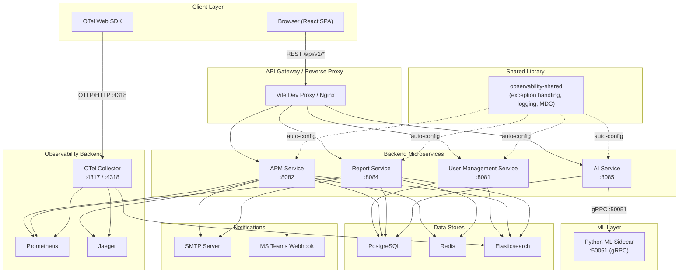

### 4.2 Data Flow Summary

| Flow | Path |
|------|------|
| **User Request** | Browser → Vite Proxy → Backend Service → PostgreSQL/Redis → Response |
| **Metrics Query** | Frontend → APM Service → Prometheus (PromQL) → Time-series data |
| **Log Search** | Frontend → APM Service → Elasticsearch (query DSL) → Log entries |
| **Trace Lookup** | Frontend → APM Service → Jaeger (Query API) → Span data |
| **Alert Evaluation** | Scheduler → APM Service → Prometheus/ES → SLA check → Alert state transition → Notify |
| **Report Generation** | Frontend → Report Service → Redis queue → Async worker → Prometheus/ES → PDF → Email |
| **AI Inference** | Frontend → AI Service → gRPC → Python Sidecar → ML model → Response |
| **Telemetry Ingest** | App (browser/backend) → OTel Collector → Prometheus + Jaeger + Elasticsearch |

---

## 5. End-to-End System Diagram

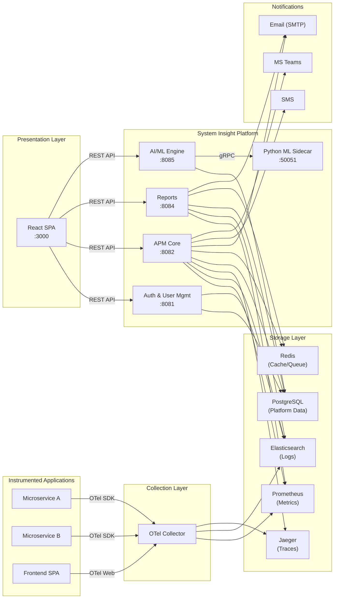

---

## 6. Backend Microservices Architecture

### 6.1 Service Inventory

| Service | Port | Responsibility | DB | External Integrations |
|---------|------|----------------|----|-----------------------|
| **observability-shared** | — | Shared library (auto-configured): exception handling, MDC logging, AOP tracing | — | — |
| **user-management-service** | 8081 | Authentication (JWT + OAuth2), RBAC, user/role CRUD, audit logging | PostgreSQL | Elasticsearch (audit), Azure AD |
| **apm-service** | 8082 | Service catalog, metrics/logs/traces queries, alerts, SLA rules, dashboards, workflows, dependencies | PostgreSQL | Prometheus, Elasticsearch, Jaeger, Redis, SMTP, MS Teams |
| **apm-report-service** | 8084 | Report generation (PDF), scheduled delivery, synthetic monitoring | PostgreSQL | Prometheus, Elasticsearch, Redis, SMTP |
| **apm-ai-service** | 8085 | ML inference bridge: anomaly detection, root-cause analysis, forecasting, LLM diagnosis | PostgreSQL | Python ML Sidecar (gRPC), OpenAI/Anthropic |

### 6.2 Backend Package Structure

```
backend/
├── observability-shared/          # Shared library
│   └── src/main/java/.../shared/
│       ├── dto/                   # ApiResponse, ErrorResponse, PagedResponse
│       ├── exception/             # ObservabilityException hierarchy
│       ├── filter/                # MdcLoggingFilter
│       ├── aspect/                # LoggingAspect
│       └── config/                # SharedAutoConfiguration
│
├── user-management-service/       # Auth & Users (Port 8081)
│   └── src/main/java/.../usermanagement/
│       ├── controller/            # AuthController, UserController, RoleController
│       ├── service/               # AuthService, UserService, RoleService
│       ├── repository/            # UserRepository, RoleRepository, etc.
│       ├── entity/                # User, Role, Permission, RefreshToken
│       ├── security/              # JwtTokenProvider, JwtFilter, SecurityConfig
│       └── config/                # RateLimitConfig, ElasticsearchConfig
│
├── apm-service/                   # Core APM (Port 8082)
│   └── src/main/java/.../apm/
│       ├── controller/            # 15+ controllers (Service, Metrics, Alerts, etc.)
│       ├── service/               # 20+ services (business logic)
│       ├── repository/            # JPA repositories
│       ├── entity/                # ServiceEntity, SlaRuleEntity, AlertEntity, etc.
│       ├── dto/                   # Request/Response DTOs
│       ├── mapper/                # MapStruct mappers
│       └── config/                # Redis, Prometheus, Security, Notification
│
├── apm-report-service/            # Reports & Synthetic (Port 8084)
│   └── src/main/java/.../report/
│       ├── controller/            # ReportController, SyntheticCheckController
│       ├── service/               # ReportService, PdfRenderingService, etc.
│       ├── repository/            # ReportRepository, SyntheticCheckRepository
│       └── entity/                # ReportEntity, SyntheticCheckEntity, etc.
│
└── apm-ai-service/                # AI/ML Engine (Port 8085)
    ├── src/main/java/.../ai/
    │   ├── controller/            # AiController
    │   ├── service/               # AiService (gRPC bridge)
    │   └── config/                # GrpcClientConfig, LlmConfig
    └── src/main/proto/
        └── ml_service.proto       # gRPC service definition
```

### 6.3 Scheduled Jobs

| Service | Job | Interval | Purpose |
|---------|-----|----------|---------|
| apm-service | Alert Evaluation Engine | ~60s | Evaluate SLA rules against Prometheus/ES, transition alert states |
| apm-service | Alert Notification Dispatch | Per-rule | Send notifications to channels with suppression/grouping |
| apm-report-service | Report Queue Processor | ~60s | Pick queued reports and generate PDFs |
| apm-report-service | Report Email Delivery | ~30s | Email completed scheduled reports |
| apm-report-service | Synthetic Check Executor | ~30s | Run HTTP probes on configured endpoints |
| apm-report-service | Report Retention Cleanup | Configurable | Purge expired report files |

---

## 7. Frontend Architecture

### 7.1 Application Structure

```
frontend/src/
├── main.tsx                       # Entry point (OTel init → React mount)
├── App.tsx                        # Root component
├── routes/index.tsx               # 24+ lazy-loaded routes
├── layouts/
│   ├── MainLayout.tsx             # Sidebar + AppBar + Outlet (13 nav items)
│   └── AuthLayout.tsx             # Minimal layout for login
├── pages/                         # Feature pages (lazy-loaded)
│   ├── auth/                      # LoginPage
│   ├── dashboard/                 # DashboardPage (home)
│   ├── dashboards/                # DashboardListPage, DashboardCanvasPage
│   ├── apm/                       # ApmOverviewPage
│   ├── services/                  # ServicesPage, ServiceDeepDivePage
│   ├── metrics/                   # MetricsExplorerPage (6 tabs)
│   ├── logs/                      # LogExplorerPage
│   ├── traces/                    # TraceViewerPage, TraceDetailPage
│   ├── alerts/                    # AlertsPage, AlertHistoryPage, SlaRulesPage
│   ├── dependencies/              # DependencyMapPage
│   ├── workflows/                 # WorkflowListPage, WorkflowBuilderPage, WorkflowDashboardPage
│   ├── reports/                   # ReportsPage
│   ├── synthetic/                 # SyntheticMonitoringPage
│   └── admin/                     # UsersPage, RolesPage, ProfilePage
├── services/                      # 18 API service files (Axios)
├── store/                         # Zustand stores (auth, theme, dashboard)
├── components/common/             # ErrorBoundary, GlobalSearchBar, LoadingSpinner
├── telemetry/                     # OTel Web SDK (config, SDK, instrumentations, propagator, Web Vitals)
├── theme/                         # MUI theming (palette, dark, accents)
├── hooks/                         # useAuth, useDebounce
├── types/                         # 1000+ lines of TypeScript interfaces
└── utils/                         # Utility functions
```

### 7.2 Route Map

```
/login                          → LoginPage (public)
/home                           → DashboardPage
/apm                            → ApmOverviewPage
/services                       → ServicesPage
/services/:serviceId            → ServiceDeepDivePage (5 tabs: Overview, Metrics, Logs, Traces, Dependencies)
/metrics                        → MetricsExplorerPage (6 tabs)
/logs                           → LogExplorerPage
/traces                         → TraceViewerPage
/traces/:traceId                → TraceDetailPage
/alerts                         → AlertsPage (Active + History tabs)
/sla-rules                      → SlaRulesPage
/dependencies                   → DependencyMapPage
/workflows                      → WorkflowListPage
/workflows/:workflowId          → WorkflowBuilderPage
/workflows/:workflowId/dashboard → WorkflowDashboardPage
/dashboards                     → DashboardListPage
/dashboards/:dashboardId        → DashboardCanvasPage
/reports                        → ReportsPage
/synthetic                      → SyntheticMonitoringPage
/admin/users                    → UsersPage
/admin/roles                    → RolesPage
/profile                        → ProfilePage
```

### 7.3 State Management

| Store | Library | Persistence | Purpose |
|-------|---------|-------------|---------|
| **authStore** | Zustand + persist | localStorage (`obs-auth`) | JWT tokens, user profile, login/logout/refresh actions |
| **themeStore** | Zustand + persist | localStorage (`obs-theme`) | Mode, accent, font, section colors |
| **dashboardStore** | Zustand | — | Dashboard editor state |

---

## 8. Database Design

### 8.1 Entity Relationship Overview

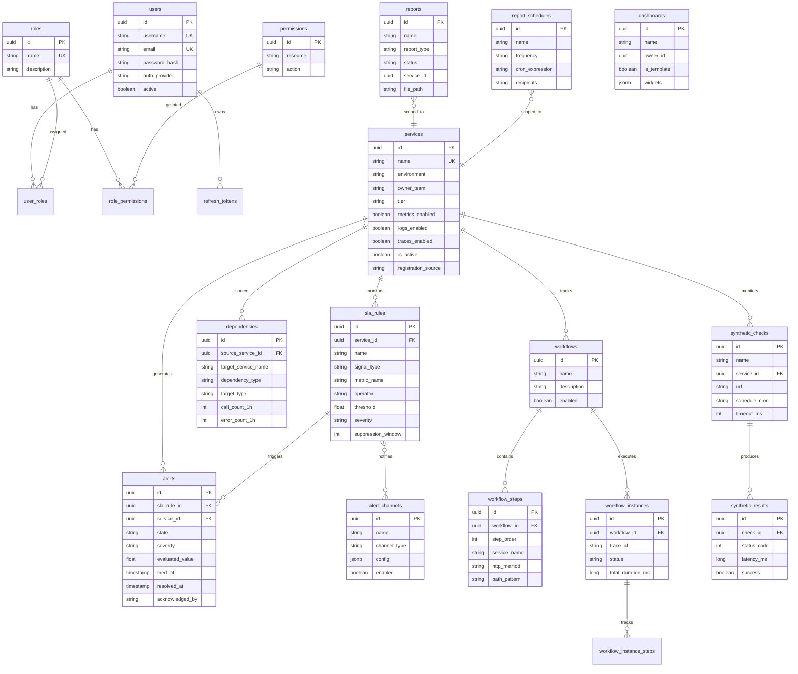

### 8.2 Database Distribution

| Database | Service | Tables | Migration Scripts |
|----------|---------|--------|-------------------|
| PostgreSQL (user-mgmt) | user-management-service | users, roles, permissions, user_roles, role_permissions, refresh_tokens | 3 Flyway scripts |
| PostgreSQL (apm) | apm-service | services, sla_rules, alerts, alert_channels, sla_rule_channels, dashboards, workflows, workflow_steps, workflow_instances, dependencies | 12 Flyway scripts |
| PostgreSQL (reports) | apm-report-service | reports, report_schedules, synthetic_checks, synthetic_results | 2 Flyway scripts |
| PostgreSQL (ai) | apm-ai-service | Minimal (inference-only) | — |

---

## 9. API Design & Conventions

### 9.1 Response Envelope

**Success:**
```json
{
  "success": true,
  "message": "Operation completed",
  "data": { },
  "timestamp": "2026-03-20T10:00:00Z"
}
```

**Error:**
```json
{
  "errorCode": "RESOURCE_NOT_FOUND",
  "message": "Service not found",
  "path": "/api/v1/services/abc",
  "traceId": "req-uuid",
  "validationErrors": []
}
```

### 9.2 HTTP Status Codes

| Code | Usage |
|------|-------|
| 200 | Successful read/update |
| 201 | Resource created |
| 202 | Async operation accepted (reports) |
| 204 | Successful delete |
| 400 | Validation error |
| 401 | Missing/invalid authentication |
| 403 | Insufficient permissions |
| 404 | Resource not found |
| 409 | Conflict (duplicate) |
| 500 | Internal server error |

### 9.3 API Endpoint Summary

| Service | Base Path | Key Endpoints |
|---------|-----------|---------------|
| **Auth** | `/api/v1/auth` | POST `/login`, POST `/refresh`, POST `/logout`, GET `/me`, GET `/oauth2/callback` |
| **Users** | `/api/v1/users` | CRUD + PUT `/{id}/roles`, PUT `/{id}/password` |
| **Roles** | `/api/v1/roles` | CRUD + GET `/permissions`, PUT `/{id}/permissions` |
| **Services** | `/api/v1/services` | CRUD + PATCH `/{id}/signals`, GET `/filters` |
| **Metrics** | `/api/v1/services/{id}/metrics` | GET `/`, `/api`, `/infra`, `/ui`, `/query`, `/logs` |
| **Traces** | `/api/v1/services/{id}/traces` | GET `/`, `/operations`; GET `/traces/{traceId}`, `/span-breakup`, `/correlation` |
| **Logs** | `/api/v1/logs` | GET `/` (search), GET `/trace/{traceId}`, GET `/enrichment-validation` |
| **Alerts** | `/api/v1/alerts` | GET `/`, `/history`; POST `/{id}/acknowledge`, `/{id}/resolve` |
| **SLA Rules** | `/api/v1/sla-rules` | Full CRUD |
| **Alert Channels** | `/api/v1/alert-channels` | Full CRUD |
| **Dependencies** | `/api/v1/services/{id}/dependencies` | GET `/`, `/graph`, `/metrics`; POST `/extract` |
| **Dashboards** | `/api/v1/dashboards` | CRUD + POST `/clone`, GET `/templates`, POST `/widgets/resolve` |
| **Workflows** | `/api/v1/workflows` | CRUD + steps, instances, POST `/correlate/live`, GET `/steps/metrics` |
| **Reports** | `/api/v1/reports` | POST `/generate`, GET `/`, GET `/{id}/download`, DELETE `/{id}` |
| **Report Schedules** | `/api/v1/report-schedules` | Full CRUD |
| **Synthetic** | `/api/v1/synthetic-checks` | CRUD + GET `/{id}/results` |
| **AI** | `/api/v1/ai` | POST `/anomaly-detection`, `/root-cause`, `/forecast`, `/error-diagnosis`; GET `/health` |
| **APM Overview** | `/api/v1/apm/overview` | GET `/` (fleet health summary) |
| **Deep Dive** | `/api/v1/services/{id}/deep-dive` | GET `/` (service health composite) |
| **Time Ranges** | `/api/v1/metrics/time-ranges` | GET `/` (preset definitions) |

---

## 10. Security Architecture

### 10.1 Authentication Flow

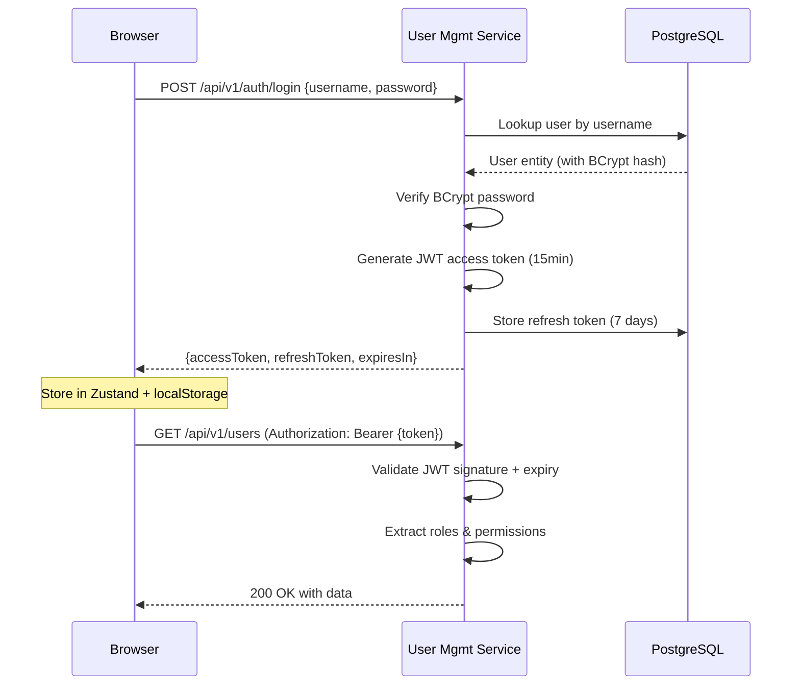

### 10.2 Security Summary

| Aspect | Implementation |
|--------|---------------|
| **Algorithm** | HMAC-SHA512 |
| **Access Token TTL** | 15 minutes |
| **Refresh Token TTL** | 7 days |
| **Password** | BCrypt (configurable strength) |
| **Session** | Stateless (no server-side sessions) |
| **RBAC** | User → Roles → Permissions (resource + action) |
| **OAuth2/OIDC** | Azure AD with auto-provisioning on first login |
| **Rate Limiting** | Token-bucket (10 req/s, 20 burst) on auth endpoints |
| **Frontend** | PrivateRoute HOC, role-based nav item visibility |

---

## 11. Sequence Diagrams

### 11.1 Service Health Deep Dive

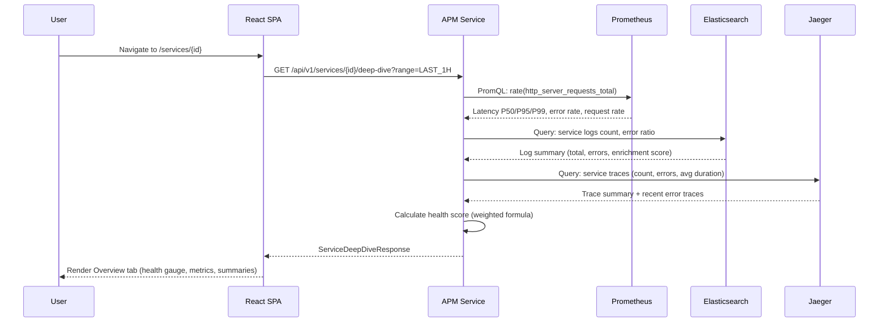

### 11.2 Alert Lifecycle

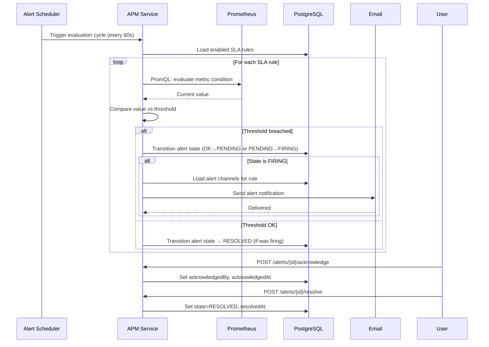

### 11.3 Report Generation

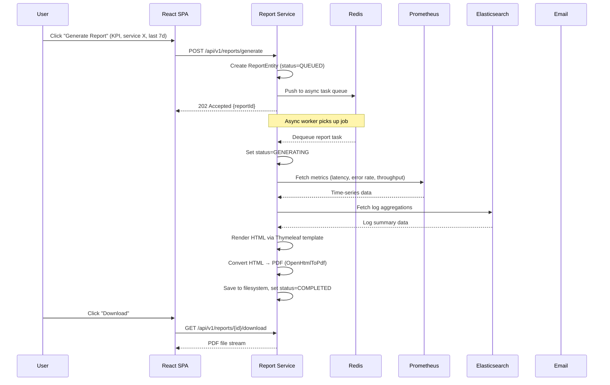

### 11.4 Distributed Trace Correlation

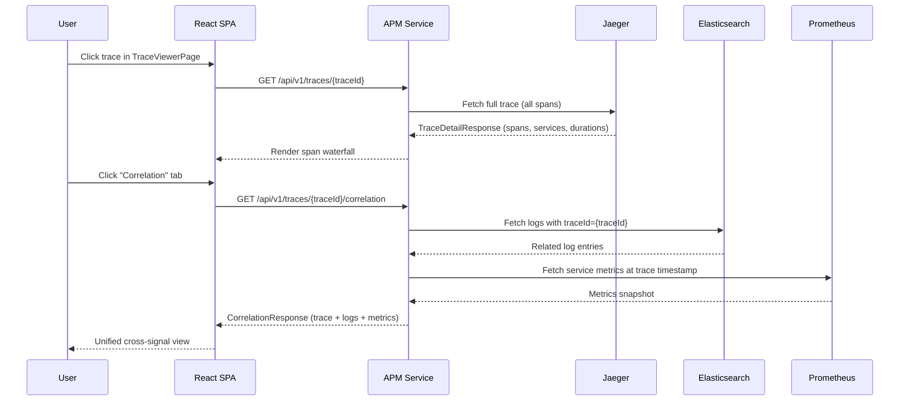

### 11.5 AI Error Diagnosis

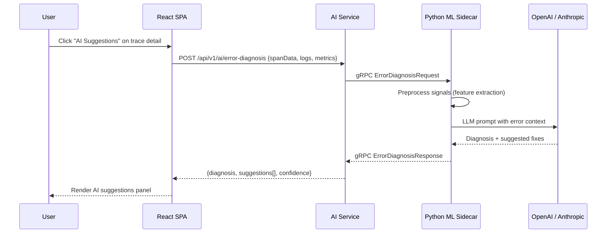

---

## 12. Observability & Telemetry Pipeline

### 12.1 Instrumentation Coverage

| Layer | Instrumentation | Signals |
|-------|----------------|---------|
| **Frontend (Browser)** | OTel Web SDK — fetch, XHR, document-load, user-interaction | Traces, Web Vitals |
| **Frontend → Backend** | W3C `traceparent` header via Axios interceptor | Distributed trace context |
| **Backend (Java)** | OTel Java SDK (auto-instrumentation via Spring Boot starter) | Traces, Metrics |
| **Backend Logging** | Logstash Logback Encoder → structured JSON with traceId/spanId | Logs (correlated) |
| **Backend Metrics** | Micrometer → Prometheus Registry → `/actuator/prometheus` | Metrics |

### 12.2 Telemetry Pipeline

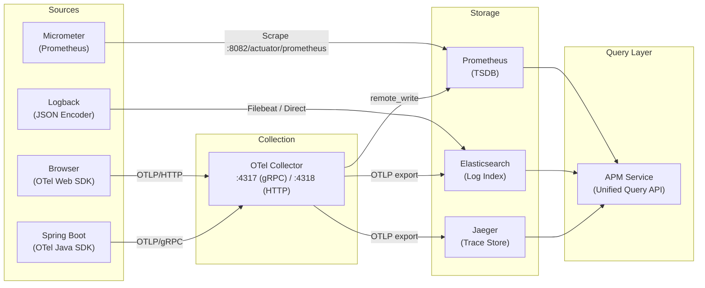

### 12.3 Web Vitals Collection

| Metric | Threshold (Good) | Collected By |
|--------|-------------------|--------------|
| **FCP** (First Contentful Paint) | < 1.8s | web-vitals lib → OTel span |
| **LCP** (Largest Contentful Paint) | < 2.5s | web-vitals lib → OTel span |
| **CLS** (Cumulative Layout Shift) | < 0.1 | web-vitals lib → OTel span |
| **INP** (Interaction to Next Paint) | < 200ms | web-vitals lib → OTel span |
| **TTFB** (Time to First Byte) | < 800ms | web-vitals lib → OTel span |

---

## 13. Deployment Topology

### 13.1 Service Ports

| Service | Port | Health Check | Metrics | API Docs |
|---------|------|-------------|---------|----------|
| Frontend (Vite) | 3000 | — | — | — |
| user-management-service | 8081 | `/actuator/health` | `/actuator/prometheus` | `/swagger-ui.html` |
| apm-service | 8082 | `/actuator/health` | `/actuator/prometheus` | `/swagger-ui.html` |
| apm-report-service | 8084 | `/actuator/health` | `/actuator/prometheus` | `/swagger-ui.html` |
| apm-ai-service | 8085 | `/actuator/health` | `/actuator/prometheus` | `/swagger-ui.html` |
| Python ML Sidecar | 50051 | gRPC health check | — | — |
| PostgreSQL | 5432 | — | — | — |
| Redis | 6379 | — | — | — |
| Elasticsearch | 9200 | — | — | — |
| Prometheus | 9090 | — | — | — |
| Jaeger | 16686 (UI) | — | — | — |
| OTel Collector | 4317/4318 | — | — | — |

### 13.2 Deployment Diagram

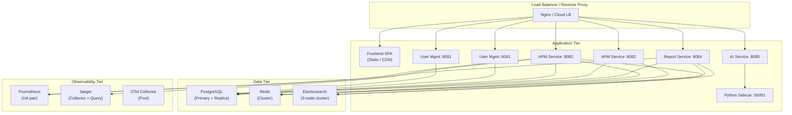

---

## 14. Module Inventory

### Summary

| Dimension | Count |
|-----------|-------|
| Backend Services | 5 (incl. shared library) |
| Frontend Pages | 24+ |
| API Endpoints | 70+ |
| Database Tables | ~20 |
| Flyway Migrations | 17 |
| Frontend API Service Files | 18 |
| TypeScript Interfaces | 60+ (~1000 LOC) |
| Zustand Stores | 3 |
| Functional Modules | 13 |
| Supported Notification Channels | 3 (Email, SMS, MS Teams) |
| Dashboard Widget Types | 6 (Time Series, Bar, Pie, Table, Gauge, Stat) |
| Metrics Tabs | 6 (Service, API, Infra, UI, Query, Log) |
| OTel Instrumentations (FE) | 4 (Fetch, XHR, Doc Load, User Interaction) |

---

*Generated on 2026-03-20 for System Insight Platform v1.0*
